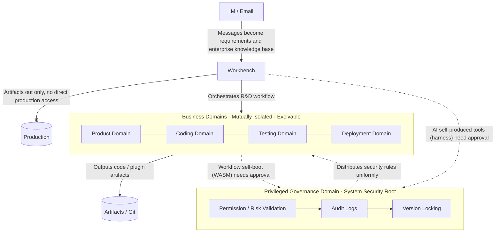

# domain-separated-self-boot-agent-runtime

> **BaijiMind · 白鳍豚心智 — Domain-Separated Controlled Self-Boot Agent Runtime**
> Domain-Separated Controlled Self-Boot Agent Architecture · Trust-domain isolation, privileged governance domain, plugin-based self-boot · MIT License

> **English** | [中文](README.md)

⚠️ Note: this project is currently **v0.1**, for validating the Domain-Separated Controlled Self-Boot Agent Architecture. It has not been validated in large-scale production environments; assess the risk yourself before deploying. Evolution path: see [Roadmap](#-roadmap) below.

📌 Current status: concept & architecture-documentation stage, code implementation in progress — the repository's core is the [Architecture Whitepaper](docs/original-2026-paradigm-en.md) (English translation; the Chinese original is [here](docs/original-2026-paradigm.md)).

## Introduction

This project takes the **Domain-Separated Controlled Self-Boot Agent Architecture** as its design goal.
The system uses trustworthy security domains as its basic model; the privileged governance domain is a special trusted domain in the domain system.
v0.1 adopts the minimal implementation of "privileged governance domain + several business domains"; the architecture itself **does not fix the number of domains**, supporting on-demand expansion and contraction.

Targeting enterprise R&D scenarios, it integrates with IM and email systems and orchestrates the complete R&D pipeline of product, frontend, backend, testing, and deployment into an executable workflow (orchestrable, self-organizing);
AI generates plugins/code artifacts; the workbench only outputs artifacts and is forbidden from directly operating production domains.

## 🧭 Architecture Overview

The core idea in one sentence: **AI can self-upgrade, but is controllable at all times and never loses safety.**

Vision: **intelligence grows freely, order remains permanently controllable** — building a "controllably free" enterprise-grade agent runtime.

> How to read: the privileged governance domain uniformly validates security; business domains are mutually isolated and evolve independently; both coding-tool (harness) and workflow (WASM) self-boot need approval; the workbench only outputs artifacts and never touches production.

## ✨ Key Features

- Domain-separated security isolation model, with the privileged governance domain uniformly handling permission, version, and risk validation
- Integrates with IM / email bots; messages become requirements and knowledge base
- Built-in lightweight visual workflow orchestration; configurable product, coding, testing, deployment stages
- Integrates multiple LLM coding capabilities; outputs plugin code, manually revised before committing to Git
- Supports external knowledge bases, RAG, graph databases, and object storage
- Business domains can be added on demand; supports evolution toward distributed cluster scenarios

## 📄 Documentation

- [Architecture Whitepaper (Chinese original)](docs/original-2026-paradigm.md) | the authoritative original whitepaper
- [Architecture Whitepaper (English)](docs/original-2026-paradigm-en.md) | full paradigm definition, product positioning, and dual-stack technical systems — IP archive document (translation)
- [Project Note (Chinese)](docs/about-note.md) | design inspiration, development notes, future plans
- [Project Note (English)](docs/about-note-en.md) | design inspiration, development notes, future plans

> As the project evolves, this section will be supplemented with security models, architecture decision records (ADR), and other documents.

## 🛠 Technology Stack (Dual-Stack Strategy)

> One architecture, two landing technical systems; the domain model and paradigm are fully unified — see [Whitepaper §8 Two Technical Systems](docs/original-2026-paradigm-en.md#8-two-technical-systems-engineering-landing-route)

- System A (primary · enterprise): Java + Golang hybrid — Java carries the rules/privileged governance domain, Golang carries execution/business self-boot domains
- System B (lightweight · cloud-native): Golang full stack unified
- Self-boot mechanism: coding tools via **harness hot-plug**; organizational components such as workflows via **WASM hot-plug** (Go runtimes wazero / wasmtime)
- Storage: OLTP, OLAP, document stores, Neo4j graph DB, MinIO object storage
- Integration: IM / email systems, RAG, Git, LLM APIs, Penpot (open-source UI design)

## 🚧 Roadmap

- v0.1: validate the architecture; basic domain model, workflows, approval-based self-boot, IM bot integration
- v0.2: improve RAG, knowledge-base directory binding, template management
- v1.0: stability hardening, production-environment adaptation

## 📃 License

This project is under the MIT License — see [LICENSE](./LICENSE) file for details.
