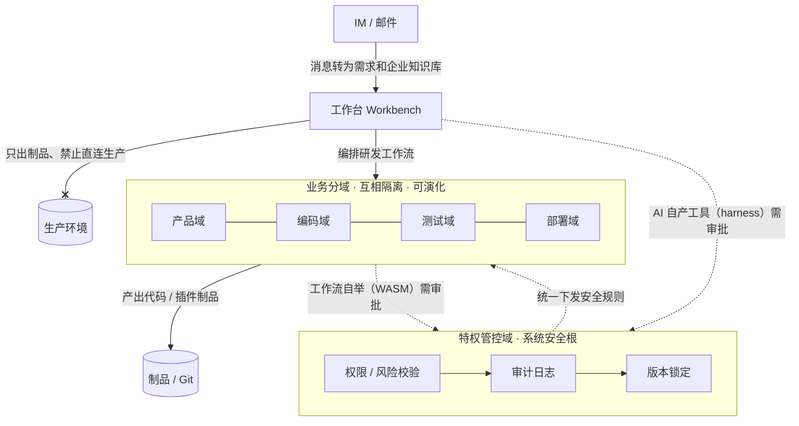

# domain-separated-self-boot-agent-runtime

> **BaijiMind · 白鳍豚心智 — 分域受控自举智能体运行时**
> Domain-Separated Controlled Self-Boot Agent Architecture · Trust-domain isolation, privileged governance domain, plugin-based self-boot · MIT License

中文 | [English](README-en.md)

⚠️ 提示：本项目目前为 **v0.1 版本**，用于验证分域受控自举智能体架构，尚未经过大规模生产环境验证，上线使用请自行评估风险。演进路径见文末 [Roadmap](#-roadmap)。

📌 当前状态：概念与架构文档阶段，代码实现推进中——仓库当前核心是[架构白皮书](docs/original-2026-paradigm.md)。

## 简介

本项目以**分域受控自举智能体架构**为设计目标。
系统以可信安全分域作为基础模型，特权管控域是分域体系中的特殊可信域；
v0.1采用「特权管控域 + 若干业务分域」最简实现，架构本身**不强制固定域数量**，支持按需扩展、收缩分域。

面向企业研发场景，对接 IM 与邮件系统，把产品、前端、后端、测试、部署完整研发流程编排为可流转的工作流（可编排、可自组织）；
AI生成插件/代码制品，工作台仅输出产物，禁止直接操作生产域。

## 🧭 架构总览

核心思想一句话：**AI 可以自我升级，但全程可控、安全不失控**。

愿景：**智能自由生长，秩序永久可控** —— 打造「可控自由」的企业级智能体运行时。

> 读图要点：特权管控域统一校验安全；业务分域互相隔离、可独立演化；编码工具（harness）与工作流（WASM）自举均需审批；工作台只出制品，不碰生产。

## ✨ 主要特性

- 分域安全隔离模型，特权管控域统一做权限、版本、风险校验
- 对接 IM / 邮件机器人，消息与上传文档转为需求与知识库，AI 持续获取项目上下文
- 内置轻量可视化工作流编排，可配置产品、编码、测试、部署阶段
- 对接多种大模型编码能力，产出插件代码，人工二次修改后提交Git
- 支持对接外部知识库、RAG、图数据库、对象存储
- 可按需新增业务分域，支持后续向分布式集群场景演进

## 📄 文档

- [架构白皮书](docs/original-2026-paradigm.md) ｜范式完整定义、产品定位与双栈技术体系，IP归档文档
- [Architecture Whitepaper (English)](docs/paradigm-en.md) ｜英文对照译本，内容与中文原文一致
- [项目说明](docs/about-note.md) ｜设计启发、开发说明、未来规划

> 随着项目演进，此处将陆续补充安全模型、架构决策记录（ADR）等文档。

## 🛠 技术栈（双栈策略）

> 一套架构、两套落地技术体系，域模型与范式完全统一，详见[范式白皮书 §8 两套技术体系](docs/original-2026-paradigm.md#8-两套技术体系工程落地路线)

- 体系A（主推·企业版）：Java + Golang 混合 — Java 扛规则/特权管控域，Golang 扛执行/业务自举域
- 体系B（轻量·云原生版）：Golang 全栈统一
- 自举机制：编码工具经 **harness 热插拔**，工作流等组织组件经 **WASM 热插拔**（Go 运行时 wazero / wasmtime）
- 存储：OLTP、OLAP、文档库、Neo4j图库、MinIO对象存储
- 集成：IM / 邮件系统、RAG、Git、大模型API、Penpot（开源 UI 设计）

## 🚧 Roadmap

- v0.1：验证架构，基础域模型、工作流、审批式自举、IM机器人对接
- v0.2：完善RAG、知识库目录绑定、模板管理
- v1.0：稳定性加固，生产环境适配

## 📃 License

This project is under the MIT License - see [LICENSE](./LICENSE) file for details.
