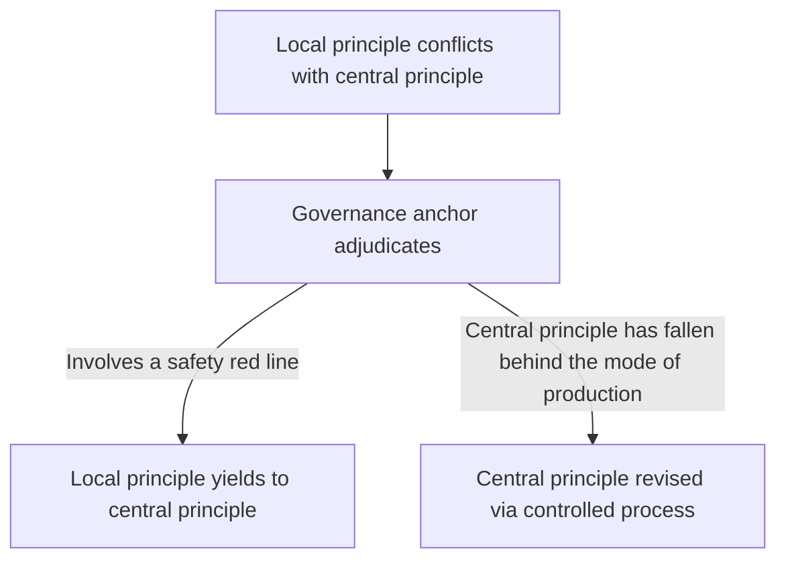
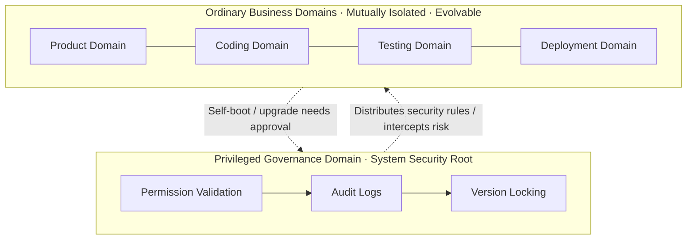
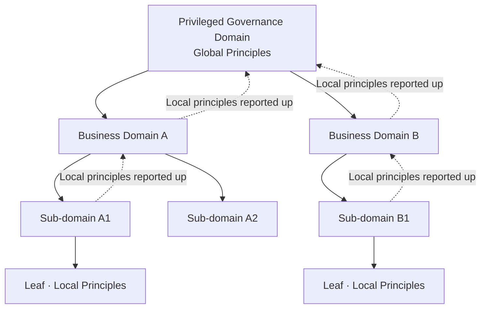
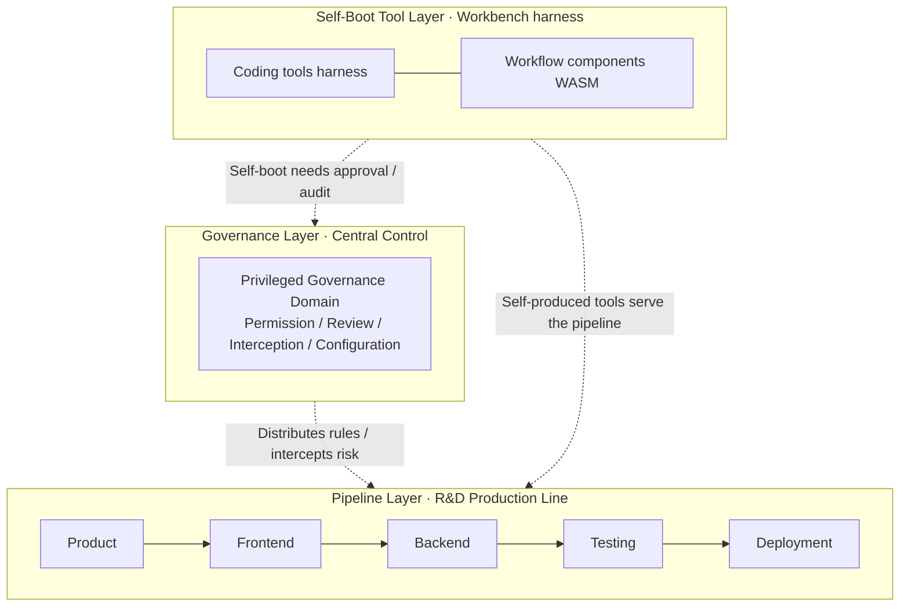
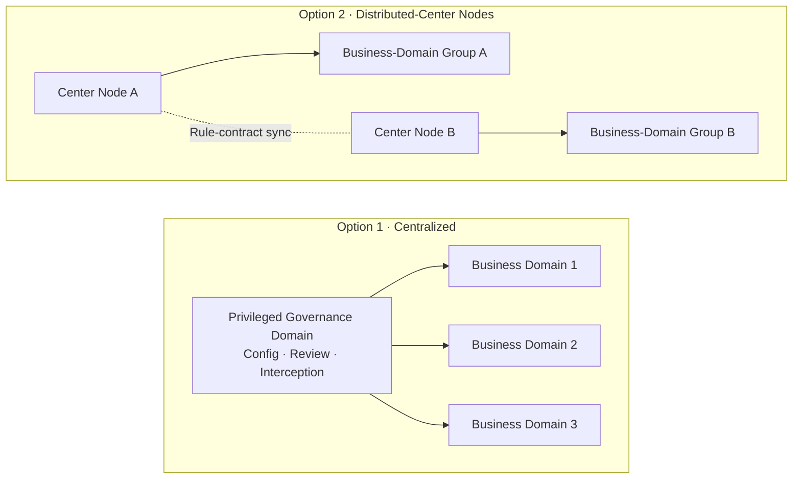
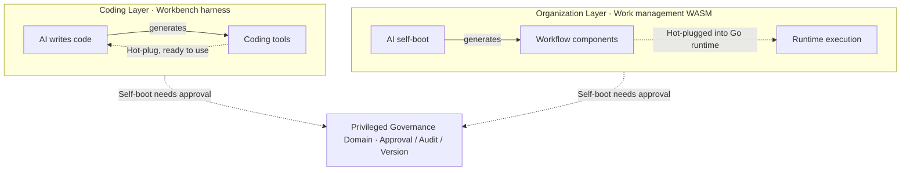

# Domain-Separated Controlled Self-Boot Agent Architecture · Original Paradigm Whitepaper (2026)

> Author: CanWeakerWriteStrongCode
>
> Translation note: This is an English translation of the original Chinese whitepaper ([`docs/original-2026-paradigm.md`](original-2026-paradigm.md), v0.1, 2026-08-21). The Chinese original is the authoritative version; in case of any discrepancy, the Chinese version prevails.

## 1. Document Description and Version

This document is an agent-architecture design paradigm independently conceived by the author in 2026, and the official design document of the Domain-Separated Controlled Self-Boot Agent Architecture.

The document fixes the architecture's underlying rules, domain-division criteria, security constraints, and extension logic. All subsequent code development, version iteration, feature expansion, and scenario deployment must follow these core definitions and will not overturn the underlying architecture.

It should be noted that this document describes the paradigm's **complete design goals** and underlying rules, not the capabilities already implemented in code; implementation progress and version planning are in the project README.

Document version: v0.1 — paradigm finalized

Document date: 2026-08-21

Corresponding open-source project: domain-separated-self-boot-agent-runtime

## 2. Official Name and Positioning

- Product codename: BaijiMind (白鳍智章)
- Alternate name: DolphinMind (海豚智章)
- Chinese name: 分域受控自举智能体架构
- English name: Domain-Separated Controlled Self-Boot Agent Architecture

Core positioning: an AI-agent architecture tailored for enterprise R&D, automated office work, and intelligent production scenarios. Core characteristic: **AI can self-upgrade, but is controllable at all times and never loses safety**. Its general conceptual core is in §3.

## 3. Conceptual Core: A Universal Organizational Paradigm for Autonomous Production

"Domain-separated controlled self-boot" is not merely a software architecture — it is a **general system-organization idea**. The question it answers: **how should production be organized so that humans and AI coordinate and play their distinct roles — supporting large-scale autonomous production and high-speed self-boot evolution, while remaining fully controllable and never spiraling out of control?**

### 3.1 Two Premises: AI and Humans as Both Production Subjects and Cognitive Subjects

In the future mode of production, AI and humans are **both production subjects and cognitive subjects** — both participate in thinking and decision-making, both act in production, differing in division of labor rather than rank:

- **AI's subjectivity lies in production execution**: undertakes large-scale, high-concurrency production execution; self-organizes pipelines, self-produces tools, and leads production evolution
- **Human subjectivity lies in goals and responsibility**: humans are simultaneously designers and inspectors — setting production goals, designing and reviewing AI's output, guarding rule red lines, and bearing ultimate responsibility

There is also a fundamental asymmetry in speed: **AI's iteration rate far exceeds that of humans**, and as self-boot capability matures, this gap will likely widen further. AI self-boot can complete a round of self-improvement — generating tools, reshaping processes, even revising local principles — in an extremely short time, while human institutions and ideas update on a scale of years. This is precisely why "controlled self-boot" exists: the faster the evolution, the more a governance anchor is needed to hold the direction — otherwise high-speed self-boot is high-speed loss of control.

Subjects are equal in rank, but **responsibility has an anchor**: the ultimate revision power of the governance anchor and central principles rests with humans (or human-designed controlled processes) — this corresponds to the dialectic in §3.2. Under current values, **humans remain the responsible subject**: ultimate responsibility is borne by humans and is not delegated away by AI's subjecthood in production; whether responsibility attribution will adjust as social values evolve is not presupposed by this paradigm.

**The similarities and differences between AI and humans in organizations determine where governance attention must lie.** What they share: both are production and cognitive subjects, and both act within the organizational framework. They differ in three places, each pointing to a different governance focus:

- **Honesty and distortion**: AI has no self-interest and reports truthfully — no interest groups, no good-news-only reporting, no rent-seeking; reporting can be fully audited as data. But it has **attention-mechanism problems**: a finite context window can lose long-range information and earlier constraints, insufficient information can cause hallucination, and optimization targets can drift from intent (specification gaming) — this is **unintentional distortion**. So AI governance need not guard against "lying" (no one is deliberately deceiving), but must guard against "attention distortion" — via §3.2.3's boundary reports and test-driven verification, which encode behavior into checkable assertions. Humans, by contrast, have considerations and interests and their reporting distorts — **intentional distortion** — which must be counteracted through decentralization and cross-validation.
- **Speed and control**: AI iterates at millisecond scale and develops too fast — the governance focus is **control**: how to hold the processes and the global structure, constrain high-speed self-boot, and prevent high speed from becoming loss of control. Humans change on a year scale — the governance focus is **change**: how to overcome institutional inertia and catch up with the mode of production. So for AI, the core contradiction is "control"; for humans, it is "change."
- **Responsibility**: humans can bear ultimate responsibility and be held accountable as natural persons; AI cannot — the responsibility anchor always rests with humans (see above).

In one sentence: **AI is fast and free of self-interest — its risk is loss of control, so governance weighs "control"; humans are slow but can be responsible — their risk is inertia, so governance weighs "responsibility" and "change." The two complement each other within the same organizational framework — AI's speed is held by the governance anchor, humans' slowness is made up by AI's self-boot.** (Detailed organizational differences are in §9.)

### 3.2 A Dialectical Core: Productive Forces and Relations of Production

AI's self-boot — self-producing tools, self-organizing processes — is the **productive force** of system evolution; the governance layer (central principles) is the **relations of production** constraining how the productive forces operate. The two form a dialectical relationship:

- **Productive forces drive the relations of production**: new modes of production continually emerge and keep pushing revision of central principles — governance rules must evolve with the mode of production, not become rigid
- **The relations of production guide and constrain the productive forces**: central principles constrain AI's self-boot and prevent loss of control, while also **guiding the direction of production** — delimiting boundaries and priorities and steering autonomous evolution toward set goals
- **Revision of central principles is itself controlled**: initiated by humans or controlled processes, not left to unconstrained self-modification by AI — this is the meaning of "controlled" in "controlled self-boot"

In one sentence: **"Units evolve autonomously; governance anchors keep control."** — that is, the vision: **intelligence grows freely, order remains permanently controllable**.

The alternating negation of self-boot and governance drives the system in **spiral ascent**: self-boot forces governance to upgrade, and governance in turn relaxes constraints for bolder self-boot — the two are mutual ladders, not a static equilibrium.

### 3.2.1 The Transformation Mechanism: Two Interlocking PDCA Loops

The transformation of productive forces into relations of production does not happen automatically the moment "new modes of production keep emerging." **Productive forces have their own PDCA loop, and relations of production have their own PDCA loop; the two loops interlock and drive each other** — the upgrade of the relations of production does not automatically follow the productive forces; it is only after the productive forces' upgrade "breaks the old equilibrium" that the relations' own loop catches up.

**The productive-forces loop (self-evolution of tools / modes of production)**:

- **D** Work using tools (the agent invokes harness in real tasks)
- **C** Tool introspection (mechanical signals + usage summaries: retries, friction, inefficiency)
- **P** Propose new tools / new modes of production (new plugins, new tool versions)
- **A** Approve and promote (write-and-run in the sandbox → version goes live → registered into effect)

Output: **new productive forces**. This loop is the most fully mechanized (tool introspection, sandbox promotion, capability registry — see the §3.3 example).

**The relations-of-production loop (self-evolution of governance / processes / rules)**:

- **D** The organization runs under current rules, processes, and approval gates
- **C** Periodic observer review + privilege-escalation audit + process inspection — checking not only "how well the work got done" but "**whether the rules themselves still fit the current mode of production**": bottlenecks, rigidity, misplaced approval gates, outdated permission boundaries
- **P** Relations-of-production revision proposals: new process definitions, new approval gates, granting or tightening permissions, revising central principles, even new domain divisions and governance forms (§7)
- **A** The governance anchor approves the revision and publishes it (revision power rests with humans / controlled processes, see §3.1); validated results are solidified into central principles, ineffective ones are rolled back

Output: **new relations of production**.

**Interlocking drive — the mechanism of "when productive forces upgrade, how do the relations of production follow?"**:

- **Passive drive (friction-driven)**: every time the productive-forces loop turns, its landing (the new tool / new mode of production from A) inevitably breaks against or touches the old boundary of the relations of production — denied privilege escalations, approval bottlenecks, process mismatches, outdated rules. All these **friction signals** flow into the C of the relations-of-production loop (audit/observer), driving that loop to revise and catch up. So "productive forces drive the relations of production" is not a slogan — it means the landing of the productive forces physically collides with old rule boundaries, produces observable friction, and triggers revision.
- **Active drive (review-driven)**: the relations-of-production loop also turns on its own initiative — the observer periodically reviews the rules/processes themselves, not waiting for the productive forces to collide, actively finding "this rule already needs to change."

The net effect of the two interlocking loops is §3.2's **spiral ascent**: productive-forces loop A (new tool lands) → relations-of-production loop C (senses lag/friction) → P/A (revise: loosen or set boundaries) → the productive-forces loop's next D turns more boldly within the new boundaries.

**The governance anchor** is the executor of "standardization" in A of the relations-of-production loop: solidifying validated experience into rules and rolling back what does not fit — "control" runs through both loops, keeping neither out of control.

Examples:

- **Productive-forces loop**: AI writes release notes with harness for the third time; C (tool introspection) finds "every time the change list is assembled by hand" → P proposes a "release-note generator" plugin → A approves and registers it, generated automatically from then on. The productive-forces loop turns once.
- **Relations-of-production loop**: C (observer) finds "UI review always stalls at the same node waiting for a human" → P proposes adjusting the process node / adding review automation → A approves and the new process takes effect → validated. Or C (privilege-escalation audit) finds "a certain type of operation is frequently denied" → P proposes granting permission or tightening rules → A revises central principles. The relations-of-production loop turns once.

**In one sentence: productive-forces upgrade ≠ automatic relations-of-production upgrade; the relations' "following" depends on its own loop — friction signals from the productive forces' landing (passive) and active review of the rules themselves (active), revised and caught up through C→P→A. Only when both loops are individually controlled and interlock to drive each other does the organization ascend spirally.**

### 3.2.2 The Intellectual Anchors: Bridging to Established Thought

The interlocking two loops are not an isolated invention — they are isomorphic to four mature schools of thought, each of which has a concrete landing point in this system's code mechanisms.

**① Double-Loop Learning (Argyris & Schön) — why two loops**

Organizational-learning theory distinguishes two kinds of improvement: **single-loop learning** does things better within existing rules; **double-loop learning** questions and modifies the rules themselves. The paradigm's two loops are precisely these two kinds of learning:

- **Single loop (productive-forces loop)**: the agent writes release notes for the third time → tool introspection writes the "change list is assembled by hand every time" signal into the tool-call feedback → proposes a "release-note generator" plugin → submits for approval → approved, registered into the plugin capability center, hot-plugged into effect → generated automatically next time. **The rules (release process) did not change; the system got smarter within the rules.**
- **Double loop (relations-of-production loop)**: the observer's periodic audit finds "the release-approval node waits on a human for 2 days, bottleneck indicators abnormal" → proposes revising the process definition (remove or replace that node) → the governance anchor approves → a new process version takes effect → **the rules themselves were changed.**

**② Law of Requisite Variety (Ashby) — why governance must evolve with the productive forces**

The cybernetic law: the variety of the controller must be ≥ the variety of the system being controlled, otherwise control is lost. Here, what is being controlled is an increasingly diverse mode of production:

- AI self-boot keeps increasing capability identifiers (from a few built-in to dozens self-booted), and calling scenarios and privilege-escalation patterns grow along with them.
- If central principles were only fixed static rules, any new capability or new escalation beyond the rules' coverage → default allow or default deny → loss of control.
- The response is "evolvable governance": approving a new capability simultaneously adds rules (approval and rule revision are linked); the privilege-escalation audit finds "a certain type of operation is frequently denied" → grant permission or tighten rules; central principles themselves can be versioned (isomorphic to plugin versions). **The governance means must keep up with the variety of the mode of production.**

**③ Dissipative Structures / Negative Entropy (Prigogine) — why a governance anchor is needed**

From a thermodynamic view, an open system maintains order by continuously importing negative entropy; far from equilibrium, self-organization emerges. Both faces of this law appear in the system:

- **Self-boot = self-organization far from equilibrium**: each plugin/new process the AI produces adds +1 to the system's capability dimension; the structure becomes more complex and more ordered.
- **The entropic trend**: more plugin versions, expanding events, more escalation attempts, scattered rules — without governance, the interior drifts toward config drift, permission chaos, and process loss of control.
- **The governance anchor = negative-entropy injection**: the plugin-runtime registry reconciles against the control-plane versions to prevent drift; the audit log records everything to prevent escalation from spreading; approval + version + rollback prevent self-boot from tampering arbitrarily; distributed locks prevent scheduled tasks from running repeatedly — every mechanism is one "injection of order," pulling the system back from the edge of chaos toward order. **"Intelligence grows freely, order remains permanently controllable" is, in essence, a battle against entropy.**

**④ Directed Evolution (variation—selection—retention) — why every self-boot step needs approval**

Evolution = variation + selection + retention; this system's self-boot is an artificialized, directed version of the same scheme:

- **Variation**: the agent generates a plugin draft with the plugin-proposal tool → the draft enters a pending-review state.
- **Selection (approval = artificialized natural selection)**: the draft trial-runs in the sandbox's development state (small-scale validation) → submitted for approval → humans/the governance anchor pass it (retain) or reject it (eliminate).
- **Retention**: once passed, it becomes an official version and registers into the plugin runtime → its capability identifier enters the discovery route, is invoked by subsequent tasks, and becomes organizational "genes"; rollback is removing genes that no longer fit the environment.
- Difference from natural evolution: variation is purposeful (AI intelligence, not random mutation) and selection is directional (the governance anchor steers toward set goals, not blind environmental pressure) — hence **directed evolution**.

In one sentence: double-loop learning answers "why two loops," requisite variety answers "why governance must evolve," dissipative structures answer "why a governance anchor is needed," and directed evolution answers "why every step needs approval" — together the four schools confirm: **this set of organizational laws is not an invention but the mechanized landing of mature laws.**

### 3.2.3 The Efficiency Lever: Multi-Pronged — Making Approval Keep Up with Self-Boot

**The dilemma**: speed asymmetry creates a governance dilemma: AI self-boot iterates at millisecond scale (see §3.1), while humans as inspectors and final approvers — if they review AI output line by line — reviewing too carefully makes them the bottleneck of evolution (approval backlog, process rigidity); reviewing too fast makes them a rubber stamp (control in name only). The essence of the dilemma: **human attention cannot keep up with AI's output volume**.

**The solution is multi-pronged, not a single mechanism**. Making approval keep up with self-boot cannot be solved by any single method; it is a set of mechanisms working together — **pattern-based triage** makes routine review fast, **two-level review** ensures neither the local nor the global is missed, **boundary reports + test-driven verification** make safety checkable and selection well-grounded, and the **pattern library** compounds review efficiency. Each is elaborated below.

**Prong 1: patternization — making routine review fast**. The lever is **solidify repetition into standards; leave attention for exceptions**, drawing on two mature ideas in software engineering:

- **Convention over configuration (Spring Boot)**: default behavior is solidified into conventions, only exceptions are explicitly configured — the same for review: most output falls into conventions, humans review only the exceptions
- **Design patterns (GoF)**: recurring solutions are solidified into patterns; recognizing a pattern means understanding its behavior — the same for review: recognizing an output's pattern means understanding its behavior without reading line by line

This lever was not invented for review — it is a mature practice production has long verified: component libraries, scaffolds, low-code orchestration, and classic database-design patterns such as the **history/slowly-changing table** (a full historical trail) and the **closure table** (tree-structure storage) — all are landings of "solidify repetition into standards." Review merely applies this production-verified efficiency lever to the gatekeeping of AI output — **triaging output by pattern**:

- **In-pattern output (~80–90%)**: most plugins, workflows, and config changes produced by AI self-boot are combinations of known modules that fall into established convention templates. Review becomes **in-pattern validation** — compare against the pattern template + AI-assisted pre-checks (automated tests / static validation / boundary checks) + human pattern-level confirmation → fast approval.
- **Out-of-pattern output (~10–20%)**: output that is genuinely novel and falls into no known pattern enters the **deep-research channel** — humans review deeply, designing new patterns when necessary.

**Prong 2: two-level review — neither the local nor the global is missed**. Review cannot be aimed at a single output alone:

- **Component-level review (local patterns and conventions)**: every component has its own dedicated patterns and conventions — plugins follow plugin-type templates, workflows follow stage templates, tools follow invocation contracts. Review whether a single output falls into the pattern it should belong to and conforms to that component's conventions (in-pattern fast-check / out-of-pattern deep-study).
- **Organization-level review (organizational structure and paths)**: output is not isolated — it must fit into the overall organizational structure: which domain it belongs to, which organizational paths it traverses (process orchestration, cross-domain flow, data flow), and which inter-domain boundaries it touches. Review whether the output's change to the organizational structure crosses boundaries, conforms to central principles, and disturbs other domains — corresponding to §3.3's local vs central principles: **component-level review looks at the local; organization-level review looks at the global**.

**Prong 3: boundary reports + test-driven verification — safety checkable, selection well-grounded**. Pattern-level confirmation is only part of review; humans must also define boundaries and hold the tests:

- **Boundary definition**: AI generates a **boundary report** — summarizing the output's behavioral boundaries: which behaviors fall within established patterns and permission scopes, which skirt the edge, which cross existing boundaries, and which involve safety red lines. Humans use the boundary report to decide "where this boundary should be drawn and whether it should move," and study whether new out-of-boundary situations should be solidified into new patterns or existing boundaries tightened/loosened — **the final judgment on safety red lines always rests with humans** (see §3.1).
- **Test holding**: test-driven verification makes boundaries checkable — **AI self-boot output is test-first**: when generating plugins / workflows, tests are produced first, using tests to define expected behavior and boundaries; only output that passes the tests may be promoted (giving §3.3's directed-evolution "selection" an objective basis). Tests are the **executable expression** of boundaries and red lines — the boundary report describes boundaries; tests encode boundaries as assertions. In-pattern output is fast-validated by the pattern template's regression tests; out-of-pattern novelty is defined by new tests — what humans review is whether test coverage holds the boundaries, not the line-by-line implementation.

**Prong 4: the pattern library — compounding review efficiency**. Patterns are not a dead list but a living library that evolves with the mode of production: AI output that falls into no known pattern → a "new-pattern proposal" → humans review deeply → solidified into the pattern library (the library itself is versioned and approvable); once a new pattern is solidified, all subsequent similar output is fast-reviewed — review efficiency rises, which in turn supports bolder self-boot. This is a positive-feedback loop — the landing of §3.2's spiral ascent in review efficiency: **self-boot → pattern recognition → pattern-library evolution → faster review → bolder self-boot**. That new-pattern solidification requires approval is exactly "central-principle revision is controlled" — the pattern library is a concrete carrier of the relations of production evolving with the productive forces.

**Extension: this set of mechanisms also guides the reform of human organizations themselves**. Facing constantly changing organizational forms, human organizations have always been evolving toward "using standards for routine work and experts for exceptions," with real prototypes already in institutional practice:

- **Approval system → filing / commitment system**: the main line of administrative-approval reform is precisely the institutional version of "pattern triage" — routine matters are changed to filing and pass quickly against standards (in-pattern fast release), while high-risk matters keep approval and go through argumentation (out-of-pattern deep study)
- **Central approval institutions**: carry the governance anchor — project-approval gates (approval gates), policy-making (central principles), planning guidance (steering the direction of production) — the projection of "controlled self-boot" at the national-economic level
- **Expert panels / review committees** (feasibility, environmental, technical review): carry the deep-study channel and boundary gatekeeping — out-of-pattern, high-risk, and innovative projects are released only after deep argumentation by experts

So the direction for reforming human organizations is clear: **establish a pattern library** (solidify experience into standards), **staff expert panels** (hold boundaries), **set up a central anchor** (unify rules and approval), and **conduct boundary audits** (continuous review) — in the AI era, the same mechanism is data-driven and automated, and the organization uses standards for routine work and experts for exceptions, keeping up with the speed of self-boot.

Humans are thus freed from "reviewing every line" to "reviewing patterns and defining boundaries": patternization makes routine review fast, two-level review does not miss the whole, boundary reports + test-driven verification make safety checkable, and the pattern library compounds efficiency — **only with a multi-pronged approach can approval keep up with the speed of self-boot**, avoiding both the line-by-line bottleneck and the rubber stamp.

### 3.2.4 AI Proposes Only: Avoiding Alignment Risk via Centralized Approval

**The theoretical origin: AI systems' "organizational failure" is isomorphic to human organizations but rooted differently**. The pain points of large human organizations are principal-agent problems, rent-seeking, and departmental silos — rooted in human self-interest, manifesting as organizational politics. Multi-AI-unit systems exhibit equivalent failures (goal misalignment, spec-gaming), but AI has no self-interest — the root is **incomplete goal specification**; organizational politics is replaced by the alignment problem. The organizational-economics analytical framework can be reused by replacing "human self-interest" with "incomplete-specification misalignment" (corresponding to §3.1's "unintentional distortion").

**Humanity's two sets of governance means cannot be simply copied by AI**:

- **Hard institutions** (audit, decentralization, budget, approval): on the AI side these can be engineered (sentinel audit agents, sandboxing, quotas, circuit breaking) — big companies have already done this; but they can only handle **detectable** vulnerabilities
- **Soft constraints** (values, beliefs, cultural internalization): humans can genuinely internalize them; AI's RLHF / DPO / constitutional AI merely **simulates behavioral tendencies** — an auxiliary line of defense that **can be breached under strong optimization pressure and cannot backstop gray zones**
- Humans fill institutional gaps with belief; AI needs to compensate via **global delayed-feedback loops** (recommendation systems have done this; general multi-agent still faces engineering challenges such as attribution and latency — see §3.2.3 test-driven verification)

**The core proposal: AI proposes only, never makes real-time online decisions**. AI converts business requirements into plugin / microservice code and configuration, with **no business-execution authority**; after automated pre-review + (tiered) human review + simulation validation, confirming no "local optimum harms the global," the version is solidified and goes online — **production runs on deterministic static plugins; AI exits the runtime path**. This is the landing baseline of "controlled self-boot + humans in the loop": how far is control? **Up to "no AI online."**

**Applicable scenarios and scale-based positioning**. Enterprise back-office, policy, risk-control, and data-operator scenarios change on a day/week cadence, and human review throughput can hold up; C-end real-time interactive agents do not fit this scheme. And it is **scale-based** — small and mid-size companies change slowly and **do not need full AI self-iteration**; centralized approval is exactly enough. Large companies need immediate response and have the financial resources to invest in **more complete AI self-guidance and control** (higher autonomy, more self-boot channels), echoing §7's dual forms: small/mid firms follow the converged form, large firms may follow a higher-autonomy form — but no matter how high the autonomy, the baseline **"red lines judged by humans, releases rollback-able" does not change**.

**Key risks (human review cannot eliminate them)**:

① AI writes plugins that look correct on the surface but hide negative externalities — code review alone cannot see it; **simulation must check global metrics**
② Accumulated small requirements make review a bottleneck — need **tiered approval**: low-risk parameter changes auto-release, only high-risk needs human review
③ A single plugin is fine, but combinations of plugins exhibit emergent negative externalities — need **integration regression simulation**
④ Humans can be fooled by complex code and miss defects — need boundary reports + test coverage as backstop (see §3.2.3)

**The essence (organizational analogy)**: abandon the high-risk/high-efficiency route of "fully delegating AI autonomous agents" and choose **centralized approval mode** — AI is like a senior proposal author holding only proposal power; humans hold the final decision power. This avoids spec-gaming alignment risk at the root during online operation, trading some dynamic flexibility for controllability, auditability, and rollback-ability.

**The complete loop**: AI generates → automated pre-review → [simulation + tiered human review] → solidified plugin deployment → runtime global-metric monitoring, automatic circuit breaking on anomalies.

### 3.3 Three Structural Core Elements

1. **Domain separation** — decomposes the system into mutually isolated, clearly-responsible independent units (domains). Units do not run exposed and do not cross boundaries; faults do not spread and chaos does not propagate.
2. **Controlled self-boot** — allows each unit to autonomously improve its own capability: generating new tools, new processes, new capabilities, and even the unit's own **local principles**. Self-boot is the engine of system evolution, but must stay within governance boundaries.
3. **Governance anchor** — the system needs one (or a group of) governance domains as its "anchor," uniformly controlling rules, permissions, review, and interception, guaranteeing "freedom without loss of control."

When a **local principle** conflicts with a **central principle**, the governance anchor adjudicates, following two criteria: if a safety red line is involved, the local principle yields to the central principle; if the central principle has fallen behind new modes of production, the central principle is revised through a controlled process — this is exactly the "productive forces drive the relations of production" of §3.2.

**The complete lifecycle of controlled self-boot (example)** — illustrated end-to-end with "the AI discovers in collaboration that it keeps having to write release notes":

1. **Discovery**: in process execution, the agent writes release notes for the third time and recognizes a reusable pattern (**instant discovery**); the observer's periodic audit also lists it as a candidate (**periodic discovery**); tool introspection finds "assembling the change list" is repeatedly done by hand (**tool introspection**). Three discovery channels converge at one point.
2. **Write-and-run (the freedom of self-boot)**: the agent drafts a "release-note generator" plugin and loads it into the sandbox's **development state** to trial-run immediately — it may only touch sandbox resources and never production; the boundary is guaranteed by the sandbox.
3. **Promotion (the control of self-boot)**: trial run satisfactory → submit for approval → approved → version officially takes effect → registered into the plugin capability registry (contract, capability identifiers, event subscriptions) → begins receiving real business/IM event traffic (e.g., "a group message matching the keyword 'release' triggers it").
4. **Retention and rollback**: plugins are version-managed and old versions can be rolled back at any time, with full audit; if a plugin performs poorly, tool introspection will summarize again and propose an upgrade or retirement — a new summary opens a new loop.

This example shows the three elements of self-boot in place: **discovery (summary-driven) — execution (sandbox freedom) — promotion (governance-controlled)**, with every step observably and auditably recorded.

**The success criteria of self-boot** — whether a self-boot act "succeeds" is not judged by "whether a plugin was produced" but by four criteria:

1. **Authentic origin**: self-boot must be organically discovered from the **summary of work** (the observer / tool introspection / recognizing a reusable pattern in collaboration), not an arrangement staged for demonstration — no summary, no self-boot; this is the starting point of "work summary → relations-of-production development" (§3.2.1).
2. **Controlled throughout**: from variation (drafting), selection (approval), to retention (registration into effect), every step stays within the governance anchor's boundaries, auditable and rollback-able — freedom and control are two sides of one coin (§5, Principle 2).
3. **Real value**: it is actually adopted by the organization, replacing what used to be repetitive manual work, rather than "produced but unused" idling.
4. **Sustained evolution**: it leaves evolutionary traces and drives a change in the relations of production (processes/rules revised because of it, §3.2.1 relations-of-production loop), and can undergo tool introspection and produce version upgrades — compounding, rather than a one-off accident.

The opposite is **pseudo-self-boot** (not a success): self-booting for demonstration (staged), produced but unused (idling), or breaking the controlled boundary (loss of control) — all three are deviations from "controlled self-boot": the freedom of self-boot must always stay within governance boundaries.

### 3.4 Carriers: One Idea, Many Landing Forms

This idea can land on any "autonomous production + controlled governance" system; each landing form is a **carrier**:

- **Carrier One: enterprise software R&D** — AI agents complete the full product, coding, testing, and deployment pipeline within controlled domains, self-improving through plugin-based harness. The current v0.1 demo is this carrier.
- **Carrier Two: large-scale socialized autonomous robot production** — robots, production lines, and factory clusters serve as production domains, governed by a governance center and evolving autonomously within controlled boundaries. A long-term form.
- Carriers are not limited to these: automated office work, intelligent production scheduling… any scenario requiring "autonomous production + controlled governance" can apply the same paradigm.

Below, the architecture details follow **Carrier One (enterprise software R&D)** as the main line; other carriers adapt to the same paradigm without redesigning the underlying architecture.

## 4. Product Positioning

This section uses Carrier One (enterprise software R&D) as the landing scenario, elaborating the industry background and commercial choices facing this idea when it lands.

### 4.1 Commercial Background

Today's AI agents — most agent frameworks — lean toward one extreme: either **free-form self-boot** — able to self-generate, self-iterate, and reshape processes, but lacking baseline control; or **constrained control** — locking AI into fixed processes, achieving safety but sacrificing self-evolution. The former's loss-of-control tendency creates a core commercial contradiction: **the smarter and more self-booting the AI, the less willing enterprises are to put it into production** — no isolation, no permission domains, no rule locks, no audit, no fallback — in essence, **completely free self-boot**, subject to no constraints — precisely the opposite of "controlled self-boot."

What enterprises truly need: **making AI the enterprise's "brain" and "hands"** — the brain handles requirement understanding, task planning, production decision-making, and process orchestration; the hands handle large-scale, high-concurrency production execution and artifact output; while keeping a human-controllable safety baseline. This brain-and-hands system is **auditable, interceptable, and rollback-able** — the engineering meaning of the vision "intelligence grows freely, order remains permanently controllable."

And for the "brain" to think well, a prerequisite is **understanding the project**: through IM/email and document uploads, requirements, reviews, changes, and historical decisions flow in naturally, and AI continuously acquires and updates project context — rather than receiving only an abstract requirement stripped of context.

### 4.2 Industry Core Pain Points

1. **Runaway intelligence**: agents can arbitrarily modify configuration, processes, and code; self-boot is completely free, posing risks of self-harm and privilege escalation
2. **Insufficient isolation**: lack of hard isolation between projects and between requirements; changes interfere with each other and cross boundaries, easily causing production incidents
3. **Missing governance**: no global governance center; scattered permissions, no auditability, no risk traceability
4. **Disorderly iteration**: unconstrained self-boot and non-standardized feature expansion make the system increasingly out of control and unmaintainable long-term
5. **Poor handoffs**: team- and project-level production handoffs are not smooth — requirement hand-offs and cross-role transitions rely heavily on manual coordination, with slow flow and much rework. AI, meanwhile, responds fast and can work in shifts 24×7, naturally suited to high-speed flow — what's missing is precisely a controlled organizational orchestration to release it

This paradigm systematically responds to the above industry pain points with domain-separated isolation + controlled self-boot + privileged layered governance, balancing flexibility and safety. It should be noted: **paradigm goals do not equal what is currently implemented** — v0.1 prioritizes the smooth handoffs of "poor handoffs" and approval-based self-boot when AI modifies workflows or adds new scaffolding; other pain points will be covered as versions evolve (see README Roadmap).

### 4.3 Project Vision

Build a **"controllably free" enterprise-grade agent runtime** — giving AI **baiji-dolphin-style collective coordination and self-adaptation** while retaining a **central rule anchor**.

Ultimate realization: **intelligence grows freely, order remains permanently controllable.**

In this system, humans are always **designers, inspectors, and final approvers**: AI grows freely while humans hold the boundary in the loop and approve self-boot — growth and guarding are mutual ladders, driving the system in spiral ascent.

Let agents truly land in enterprise R&D and automated production, moving from the demonstration stage into the production stage. In the long run, perhaps this paradigm is not limited to software R&D — **large-scale socialized autonomous robot production** can be organized with a similar architecture: the center holds global rules and red lines, while production units evolve autonomously under layered control, continuously self-booting within controlled boundaries.

## 5. Five Core Design Principles (Core of the Architectural Originality)

### Principle 1: All functionality and environments are domain-separated (all-things-are-domains)

All running functions, modules, and production environments in the system are decomposed into independent "trust domains." No code runs exposed or boundary-less; from the root, functional chaos, cross-environment interference, and fault propagation are avoided. **A domain is not merely "isolated" — it is an "autonomous evolutionary unit"**: within governance boundaries, each domain can autonomously improve its own capabilities, accumulate local principles, and evolve independently (see §3.3).

### Principle 2: Self-boot is encouraged, but must be controlled (controlled self-boot)

AI's autonomous evolution is a **core value of this architecture, not an object to be guarded against**: AI generating code, adding features, modifying workflows, and iterating on its own capabilities during process execution is collectively called "self-boot." Self-boot takes **plugin-based harness** as its landing form (see §6.3): AI uses these tools to do work while continuously improving the tools themselves through the plugin mechanism — using tools and, in the process, making better tools. In engineering, coding tools go through **harness hot-plug** and workflow and other organizational components through **WASM hot-plug** (see §8.4). **Freedom and control are two sides of one coin**: AI is encouraged to self-boot boldly — this is the engine of system evolution; but all self-boot behavior passes permission validation, security review, and version locking — this is the guarantee against loss of control, preventing AI from making arbitrary changes, harming itself, or escalating privileges. The faster the self-boot, the more the governance anchor must hold the direction: evolution speed and governance intensity are directly proportional — this is the complete meaning of "controlled self-boot" (see §3.2).

### Principle 3: The system needs a governance anchor (a unified source of order, itself evolvable)

The system needs one (or a group of) governance domains as an **anchor**: uniformly controlling rules, permissions, review, and interception — it is both the "boundary of free growth" and the "direction setter," delimiting boundaries and priorities and steering autonomous evolution toward set goals. The governance anchor is not a set of rigid dead rules: it itself **evolves under control** — when the mode of production (productive forces) evolves beyond what the old rules can cover, central principles are revised through a controlled process (see §3.2's interlocking loops); the variety of governance means must keep up with the variety of the mode of production, otherwise loss of control is inevitable (the law of requisite variety, see §3.2.2).

### Principle 4: Production environments are strictly isolated — artifacts in, no mutation (strict artifact isolation)

The workbench where AI creates, develops, and generates code is completely separate from production environments. AI can only output "result artifacts" such as code, plugins, and configuration; it cannot directly modify or operate production systems, preventing AI from breaking the business. Artifacts enter production only after human-approved merging (e.g., Git feature branches + merge review), fully auditable, interceptable, and rollback-able.

### Principle 5: Human-AI collaboration, with responsibility resting on humans (humans in the loop)

AI and humans are **co-subjects with different division of labor** (see §3.1): AI undertakes large-scale, high-concurrency production execution and autonomous evolution; humans undertake goal setting, output review, and rule guarding. At every key decision — self-boot promotion, process advancement, rule revision, artifact merging — there is a **human in the loop**: humans remain the designers, inspectors, and final approvers; ultimate responsibility rests with humans and is not delegated away by AI's subjecthood in production.

## 6. Core Domain Model Design (Architectural Originality Highlight)

The core idea of this architecture is that the entire system runs domain-separated; all modules are independent domains with unified rules and standards, differing only in division of labor and permissions. Domains are not a flat stack but **vertically layered**: from central governance, to the business pipeline, to self-boot tools — each layer controlled, each layer evolvable.

Key original design: in traditional architectures, "central control" is not an independent mode — it is merely a special domain with higher privileges in the domain system. The whole architecture is unified, not fragmented, and flexibly extensible.

The above is the **centralized** domain organization — one privileged governance domain directly managing multiple business domains. The domain model also has a **tree-node** form: domains nest level by level into a tree; governance distributes along the tree; each node holds its own **local principles** within the scope of its superior's principles:

The tree-node form is an intermediate stage on the path from centralized to fully peer-to-peer (see §7): the deeper the tree's levels and the more governance nodes, the closer to distributed centers. Local-principle conflicts are reported level by level up the tree to the superior governance node for adjudication (see §3.3). This structure is isomorphic to the governance relationship between "headquarters and regional branches": headquarters establishes global principles; regional branches hold autonomy within the headquarters' framework and may enact regional procedures, but must not conflict with the higher-level framework; on conflict, the higher-level framework prevails and the local yields to the center.

### 6.1 Privileged Governance Domain (System Security Root)

The sole highest-trust control domain of the whole system, equivalent to the system's "security administrator + rule lock." Core capabilities:

- Uniformly validates all operation permissions, records audit logs, and locks core versions
- Forbids AI from self-modifying or tampering with core rules, preventing underlying loss of control
- Controls all business-domain self-boot, feature-upgrade, and capability-expansion behavior
- Formulates system security rules, distributes runtime policies, and intercepts risky operations

### 6.2 Ordinary Business Domains (Evolvable Modules That Do the Actual Work)

Independent runtime domains responsible for specific business — the units that actually land features and execute tasks, supporting AI autonomous iteration and upgrade:

- Supports AI plugin-based self-boot: automatically adding business features and iteratively optimizing capabilities
- Business domains are mutually isolated; if one domain fails, the whole system is not affected
- Supports on-demand add/remove and scale-out/scale-in to fit businesses of different sizes

### 6.3 Layered Structure: Governance Layer · Pipeline Layer · Self-Boot Tool Layer

The domain separation of this architecture is vertically layered; the core is a three-tier structure (extensible to more layers on demand):

- **Governance layer (privileged governance domain)**: uniformly controls permissions, review, interception, and configuration; the system security root; the only highest-trust domain in the system
- **Pipeline layer (business domains)**: business domains form the R&D "production line" — product → frontend → backend → testing → deployment, analogous to building an industrial production pipeline. The pipeline can be both **orchestrated** and **self-organized**: orchestration defines stages and flow via the governance layer and humans for stability; self-organization lets AI reshape flows within controlled boundaries for evolution
- **Self-boot tool layer (plugin-based harness, workbench)**: the workbench hosts harness and self-produced tools. AI writes code on the workbench, using harness tools (e.g., DeepSeek-Harness style) to do work, and **self-produces new coding tools** — using tools while improving them; these coding tools register into the workbench as **harness hot-plug tools**, recyclable, preservable, and disposable on demand. Another level of self-boot is **work organization**: when AI adds or modifies **workflows**, they hot-plug into the runtime as **WASM plugins** (see §8.4)

Layering is not limited to three tiers; it can be extended to multiple layers by business complexity. Layers and domains interact through the unified domain model and controlled contracts, and all self-boot behavior is uniformly audited by the governance layer. When a domain's local principles conflict with the governance layer's central principles, the same controlled contract escalates to the governance layer for adjudication (adjudication criteria in §3.3).

Centralized control is the default form, but not the only one — governance capability can evolve into distributed-center configuration and distributed control as the system evolves (see §7 dual-form evolution).

## 7. Dual-Form Evolution: One Architecture for All Scenarios

A major advantage of this architecture: one underlying logic, two operating forms, adaptable from small teams and small projects to large distributed clusters without architecture redesign.

### 7.1 Converged Form: Center-Domain Mode (current v0.1 landing)

Composed of 1 privileged governance domain + multiple business domains; centralized unified management, division of labor.

- Applicable scenarios: SME R&D workflows, team automated office work, daily AI task scheduling
- Core advantages: simple structure, low landing cost, clear security rules, fully controllable risk

### 7.2 Generalized Form: All-Domain Peer Mode (long-term extension)

Removes the single fixed center; all domains are peer and coordinate through unified contracts and permission rules. Governance capability can also distribute peer-to-peer — governed by multiple governance centers with **distributed configuration and distributed control**, rather than one unique center.

- Applicable scenarios: large distributed clusters, industrial robot clusters, socialized fully automatic production systems
- Core value: decentralization, no single-point center bottleneck, ability to scale horizontally to extreme size

### 7.3 Governance Form Discussion: Centralized vs Distributed-Center Nodes

The arrangement of the governance layer (privileged governance domain) is an independent design choice, with two typical options:

**Option 1: centralized governance** — one privileged governance domain as the sole center, uniformly configuring, reviewing, and intercepting. Current v0.1 adopts this option (i.e., the §7.1 converged form).

- Advantages: single rules, centralized audit, simple implementation, small risk surface
- Limitations: single-point center has bottleneck and failure risk; long governance chain in cross-region, ultra-large-cluster scenarios

**Option 2: distributed-center-node governance** — governance capability carried by multiple center nodes; nodes configure and control in a distributed manner, keeping rules consistent through unified contracts.

- Advantages: no single-point bottleneck, proximity governance across regions, horizontal scaling with scale
- Limitations: requires consistent rule distribution and synchronization; governance consistency (strong/final consistency) is the core difficulty

The tree-node form (§6) can combine with distributed centers — the internal governance nodes of the tree are the distributed centers, while the top retains a global anchor, forming a "layered autonomy" hybrid.

Adjudication difference: in centralized mode, the sole governance anchor adjudicates; in distributed-center mode, the center-node group **adjudicates jointly under a unified contract** — the contract is the only source of global rule consistency (see §3.3).

The two options are not an either-or opposition but different stages on the same evolutionary path; together with §7.2's all-domain peer form they constitute a complete governance-form spectrum: **centralized → distributed center → peer-to-peer centerless**. As systems evolve from small to large, the governance form relaxes step by step while the underlying paradigm and domain model never change.

## 8. Two Technical Systems: Engineering Landing Route

This section is the engineering landing route for Carrier One (enterprise software R&D).

Most agent frameworks on the market do only "feature stacking" without engineering-architecture layering or language-boundary definition. As a result, late-stage projects suffer: messy business, messy performance, messy permissions, messy deployment, out-of-control iteration.

This architecture reserved two production-grade landing systems from day one:

- System A: Java + Golang hybrid layered architecture (steady enterprise edition)
- System B: Golang full-stack unified architecture (lightweight cloud-native edition)

The two systems are fully unified in architectural thinking, fully compatible in domain model, and aligned in capability — differing only in the division of labor of the underlying technology stack. This is also the key engineering difference distinguishing this architecture from projects that stay at feature demos: not only AI-paradigm innovation, but a clear long-term engineering evolution route reserved in advance.

### 8.1 Underlying Differences Between the Two Languages (Core Basis for Architecture Design)

All architectural layering, domain decomposition, and responsibility division essentially adapt to the two languages' strengths and avoid their weaknesses.

| Dimension | Java / Spring ecosystem | Golang |
| --- | --- | --- |
| Character | Heavy, steady; strong complex-business modeling and enterprise governance | Light, fast; strong concurrency and cloud-native; natively suited to self-boot and WASM hot-plug |
| Core strengths | Complex business governance, transactions, permissions, processes, domain modeling, standard systems; mature ecosystem and toolchain, suited to complex business domains requiring long-term iteration | goroutine lightweight concurrency model, static single-file deployment, millisecond start/stop, **WASM hot-plug** (runtimes such as wazero / wasmtime), extremely low ops cost — ideal for "massively dynamically generated, destroyed, and scheduled" self-boot tasks |
| Weaknesses | Slow startup, heavy containers, cumbersome deployment, high concurrency-throughput cost; not suited to high-frequency lightweight scheduling and short-lived tasks | Complex business modeling, multi-layer process governance, and transaction systems less heavy and mature than Java; not suited to carrying extremely complex, frequently-changing enterprise core business rules |

### 8.2 System A: Java-Golang Hybrid Architecture (Primary Enterprise Production Form)

Core idea: **Java holds the rules, Golang holds the execution; Java does the control domain, Golang does the business self-boot domain.**

#### Java carries: the privileged governance domain (global core layer)

Give the stable, core, secure, governance capabilities to the Java Spring ecosystem:

- Global permission validation, security baseline policies
- User system, roles, resources, permissions — RBAC governance
- Audit logs, risk interception, version locking
- Workflow core rules, process approval, transaction consistency
- System configuration, global parameters, whitelists, risk blacklists

Architectural significance: the privileged governance domain must never be lightweight, casually restarted, or arbitrarily mutated. Java's steadiness better guards the "system security root," consistent with this architecture's axiom: core rules are forbidden from unconstrained self-boot tampering.

#### Golang carries: business domains + self-boot runtime (dynamic execution layer)

Give everything dynamic, variable, frequently scheduled, self-boot-generated, start-stop-destroy, and execution-related to Golang:

- Agent task scheduling, queue consumption, batch execution
- Dynamic plugin loading, self-boot capability registration and destruction
- Multi-domain parallel execution, domain-isolated resource scheduling
- Short-cycle automated tasks, temporary workflow execution
- Cloud-native container deployment, elastic scaling

Architectural significance: business domains need frequent growth, iteration, scaling, and destruction; Golang's lightweight high-speed characteristics naturally suit "controlled self-boot."

#### Core value

Java's steadiness fills the governance and safety baseline commonly missing in AI projects; Golang's lightness and speed fills the weak concurrency and hard self-boot of traditional Java projects. Control is steady, business is flexible; the center does not move, the periphery can self-boot and evolve.

### 8.3 System B: Golang Full-Stack Architecture (Lightweight Cloud-Native Edition)

Core idea: one Golang runtime, simultaneously and simply implementing control domain + business domains; unified stack, zero cross-stack cost.

#### Applicable scenarios

- Lightweight automation, personal/small-team clusters, and edge private deployment
- Scenarios pursuing extremely low ops cost, single binary, no JVM dependency, and no ultra-complex permission governance

#### Architectural trade-off

The all-Go advantage is being unified, simple, light, fast, and cloud-native. The cost: you must self-encapsulate complex permission, audit, and process systems, and the ecosystem is less mature than Java.

So this architecture positions:

- All-Go version = lightweight paradigm validation & edge cloud-native form
- Java + Go hybrid version = formal enterprise production-grade form

### 8.4 Engineering Mechanism of Controlled Self-Boot: Coding via harness, Organization via WASM

Controlled self-boot has two levels in engineering, each with its own mechanism:

#### Coding layer (workbench): harness hot-plug tools

When AI writes code on the workbench, it uses harness (e.g., DeepSeek-Harness style) to do work; self-produced coding tools register into the workbench on the fly as **harness hot-plug tools**. Core advantages of harness hot-plug:

- **Instant effect**: new tools are usable immediately — no service restart, no production interruption
- **Improve while using**: AI discovers problems while using a tool and can generate an improved version on the spot and hot-swap it — using tools while making better tools
- **Use and discard**: temporary tools are discarded after use, not polluting the workbench; genuinely valuable ones are preserved and reused
- **Self-boot loop**: AI uses self-made tools to complete more complex tasks, then builds even newer tools within the task — tool capability spirals upward with tasks (see §3.2)

#### Organization layer (work management): Go + WASM hot-plug plugins

Business domains run as microservices. When AI self-boots to the work-organization level — adding or modifying **workflows**, process orchestration, pipeline stages — these structural components are implemented as **WASM plugins**:

- Compiled to WASM (WebAssembly) modules and **hot-plugged** into Go services through runtimes such as wazero / wasmtime / wasmedge — no restart, instant effect
- WASM is inherently sandboxed (memory and host isolated) — exactly the engineering form of "domain isolation"
- Plugins can be signed, versioned, and audited; with approval gates they form the complete "controlled self-boot" loop
- Cross-language: AI can generate plugins in any language, compiled to WASM for unified integration

In one sentence: **coding tools go through harness, work organization goes through WASM** — sandbox is isolation, hot-load is self-boot, signature and approval are control.

The two self-boot mechanisms each land in their own domain: coding-tool self-boot in the workbench (coding domain), workflow self-boot in the work-organization domain. **Self-boot is itself domain-separated** — each domain self-boots by its own mechanism, never crossing or interfering. This is exactly how the domain-separation idea manifests in self-boot mechanisms (see §3.3).

#### The Complete Landing of Self-Boot

Controlled self-boot converges in engineering to four supporting pieces:

1. **The plugin capability registry (a simplified Nacos)**: lets the system know "how to call, and whom to call" — plugin registration, invocation contracts (OpenAI function schemas), discovery routing by capability key, and control-plane/runtime reconciliation. AI-written plugins are managed capability assets, not scattered scripts.
2. **Write-and-run in the sandbox → approval for promotion**: a draft plugin trial-runs immediately in the sandbox's development state (the freedom of self-boot); promotion to an externally usable capability requires approval + versioning (the control of self-boot), and can be rolled back at any time.
3. **Business-type plugins (the Feishu mini-services analogy)**: a plugin can be an "invoked tool," or it can be a **mini-service that subscribes to events and runs autonomously** (subscribing to IM group-message matches, task-status changes, flow-node entries, new documents), event-driven and self-executing — just like the host of mini-services on the Feishu platform.
4. **Authorization as the boundary**: every action of AI is bounded by the data permissions of the authorizer (whoever clicks the flow gets their permissions used); enterprise content is read only through permission-bearing interfaces, with privilege escalation denied and audited — the freedom of self-boot always stays within the governance anchor's permission boundary.

### 8.5 Unified Architecture Core Rules of the Two Systems (Key Normalization Design)

Whichever tech stack is chosen, the domain-separated controlled self-boot paradigm is entirely unchanged; this is the core confidence for long-term architecture evolution.

- Domain model unchanged: privileged governance domain / business domain model unified
- Self-boot constraints unchanged: all self-boot behavior must be controlled, auditable, interceptable
- Artifact isolation unchanged: the production domain receives only results, not modifications
- Dual-topology evolution unchanged: supports the center-converged form / peer-generalized form

### 8.6 Technical System Conclusion

1. The Java-Golang hybrid architecture is this project's primary production form, providing a unified industrialized solution to the three problem categories "AI runaway + missing enterprise governance + insufficient performance elasticity"
2. The Golang full-stack architecture is the lightweight alternative, responsible for minimalist deployment, edge scenarios, and rapid paradigm validation
3. Technology-stack layering is not arbitrary selection but deep thinking matching the domain-separated architecture's static-dynamic separation and governance-execution separation — dual-stack compatible, each doing its job, with engineering systematicity superior to single-stack frameworks

The above systems are delivered in engineering as: self-boot fully traceable, interceptable, and rollback-able; production domains receive only approved artifacts — safety and production readiness are realized in engineering mechanisms.

## 9. Extension: Human Organizations, a Natural Prior Carrier

This paradigm is not designed from thin air — it has a natural precedent validated by millennia of trial and error: **human organizations**. Companies, institutions, and societies are essentially instances of "domain separation + controlled self-boot + governance anchor," corresponding one-to-one with the conceptual core of §3:

| This paradigm | Corresponding human organization |
| --- | --- |
| Domain separation | Departments and professional division of labor: each doing its own job, fault isolation |
| Governance anchor | Management / corporate charter: uniformly controlling rules, permissions, audit |
| Controlled self-boot | Innovation and change within organizations: new processes, new tools, via approval and compliance |
| Local vs central principles | Regional procedures vs corporate charter: conflicts adjudicated by governance review |
| Centralized → distributed center → peer | Centralized control → decentralized management → divisional structure / networked organizations |
| Productive forces / relations of production dialectic | Philosophy's depiction of the organizational form of human society |

The paradigm converging on the human organizational form is exactly why it captures the organizational laws of complex production systems. Therefore **human organizations can be viewed as "Carrier Zero"** — a pre-existing, continuously running natural instance usable to validate this paradigm (carrier concept in §3.4).

And this convergence goes beyond "domain separation + controlled self-boot + governance anchor" — even the **two-interlocking-loop mechanism** of §3.2.1 is something human organizations have validated over millennia: the Deming cycle (PDCA) and lean production (Toyota's kaizen) are precisely the industrial prototype of "productive-forces loop + relations-of-production loop." Inside large companies, **platform-engineering teams** correspond to tool introspection (productive-forces loop); **internal audit / risk / compliance** correspond to the observer and privilege-escalation audit (the C of the relations-of-production loop); **retrospectives and process re-engineering** correspond to summary and revision (P/A). The difference is only in precision and speed: human loops rely on people reporting bad news, holding meetings, and writing reports — friction signals are lossy, summaries have ceremony, and revision is subject to power struggles (see "essential differences" below); AI organizations make the same mechanism **data-driven, mechanized, and depoliticized** — friction fully recorded, summaries automatically driven, revisions controlled and rollback-able. This is the deeper meaning of "Carrier Zero": the paradigm is not designed from thin air but makes the organizational laws validated by humans into an executable system.

Isomorphic to this, **the multi-pronged approach of §3.2.3 is also not newly made for AI** — facing constantly changing organizational forms (clans → tribes → city-states → empires → guilds → joint-stock companies → bureaucracy → divisional structure → platform organizations), humanity's adaptation mechanism has always been a kind of "patternization": **case law** solidifies each judgment into a precedent, and subsequent similar cases are quickly cited (precedent is the pattern library); **standard operating procedures and industrial standardization** solidify repetitive processes into standards (solidify repetition into standards); **management by exception** lets routine matters run automatically against standards and only escalates exceptions (leave attention for exceptions). **Human institutions update slowly, but humanity's adaptation mechanism is not slow** — patternization lets humans use standards for routine work and experts for exceptions. §3.2.3 merely makes this millennia-old mechanism **data-driven, mechanized, and automated** to fit AI's speed — the speed gap is closed by the mechanism, not by humans sprinting.

At the same time, AI production systems differ fundamentally from human organizations, and these differences are precisely why "controlled self-boot + governance anchor" exist:

- **Evolution speed**: AI self-boot iterates at millisecond scale; human institutions have inertia measured in years — controlled self-boot's constraints far outweigh human change management
- **Scale and replaceability**: AI domains can be generated and destroyed in an instant; domains are cheap consumables; human departments are hard to add or remove arbitrarily. This inverts the microservices principle (**Conway's Law**: system architecture reproduces the organization's communication structure) — in human organizations, "code boundaries follow organizational boundaries" is a rigid coupling; changing code structure requires first changing organizational structure; in this paradigm, domains can be rebuilt at any time, **domain boundaries can freely align with service boundaries**, decoupling the rigid organization-code coupling; for human organizations to keep up with AI's self-boot speed, the mechanism is precisely §3.2.3's multi-pronged approach — fast assembly via patternization and other mechanisms
- **Incentives vs alignment**: human organizations have interest groups, rent-seeking, and principal-agent problems; AI units correspond to goal misalignment and specification gaming — organizational politics is replaced by the alignment problem
- **Structural failure modes**: motive-driven failure modes (reporting good news and hiding bad news, rent-seeking, institutional inertia) largely disappear in pure machine systems, but structural problems remain unchanged — **local autonomy and global consistency are mutually exclusive** and can only be continuously reconciled (see §7.3); exceptions not covered by rules need on-the-spot judgment, which machines precisely lack compared to human improvisation; the "rubber-stamp" risk of humans as final approvers is not reduced by machine nodes. Additionally, machine systems introduce a failure mode human organizations lack — **accidental self-harm**: an ordinary bug on the self-boot path can inadvertently corrupt the system's own bootstrap code, requiring no malice
- **Responsibility**: human organizations ultimately hold natural persons accountable; under AI production, "under current values, humans remain the responsible subject" (§3.1) fills this role

## Appendix A: Intellectual Lineage and Related Research

### A.1 The Author's Intellectual Lineage (Independent Conception Process)

1. **Starting point — AI and humans as co-subjects**: AI and humans will both become production and cognitive subjects — AI takes on large-scale production execution and autonomous evolution, while humans as designers and inspectors set goals, review output, and bear ultimate responsibility
2. **Inspiration — DeepSeek Harness**: inspired by DeepSeek Harness's "everything is a plugin" philosophy — AI can improve the tools themselves while using them
3. **Extension — self-organized production**: from this, AI self-organizing pipelines and self-producing tools in production follows naturally
4. **Constraint — central principles**: but when AI modifies the production environment, it must be constrained by central principles
5. **Dialectics — productive forces and relations of production**: new modes of production in turn push continuous revision of central principles — just like the dialectical movement between productive forces and relations of production
6. **Convergence — the paradigm takes shape**: the above independent reasoning converges into this paradigm: domain separation + controlled self-boot + governance anchor

**A note on the term "self-boot"** — in engineering, "self-boot" borrows from the computer term bootstrap (a bootstrapping program: using the system itself to start the system), i.e., "using tools to make tools"; in thought it is isomorphic to **autopoiesis (Maturana & Varela)** — an open system maintains and renews itself by self-producing the components that constitute it. The paradigm's self-boot is precisely organizational autopoiesis: through the summary of work (§3.2.1), the organization self-reproduces new capabilities and rules, thereby self-maintaining and self-evolving; qualified with "controlled," it becomes "controlled autopoiesis," fully isomorphic to "controlled self-boot" — the difference being only the paradigm's emphasis that self-boot must happen within governance boundaries.

### A.2 Comparison with Related Research

In 2025–2026, academia and industry saw a wave of independent convergence around "controlled / charter-style self-evolving agents" (e.g., charter-style self-evolution, recursive self-improvement, polycentric governance). This paradigm moves in the same direction; its independent highlights:

- **Production organization as the primary lens**: most work focuses on AI safety governance (preventing loss of control); this paradigm focuses on how production systems are organized — pipelines, units, and governance
- **Controlled self-boot + governance anchor at peer level**: self-boot is not an auxiliary capability but an architectural pillar equal to governance
- **Self-boot domain-separated, two-channel landing**: coding tools via harness hot-plug; workflow and other organizational components via WASM hot-plug, each landing in its own domain
- **Unified across carrier scales**: from enterprise software R&D to socialized robot production, the same paradigm reproduces self-similarly
- **Productive forces / relations of production dialectic**: self-boot and governance ascend spirally in alternating negation, not static equilibrium; and the concrete transformation mechanism is given — **two interlocking PDCA loops**: the productive-forces loop (tool introspection → new tools) and the relations-of-production loop (observer/audit → rule revision), each controlled and interlocking; the friction signals from the productive forces' landing colliding with old rule boundaries drive the relations to catch up (see §3.2.1)
- **The conceptual core is isomorphic to established scholarship**: double-loop learning (Argyris & Schön), the law of requisite variety (Ashby), dissipative structures (Prigogine), directed evolution (Darwin/Campbell) — this paradigm is the mechanized landing of these mature laws, not the invention of new academic concepts (see §3.2.2)

The above synthesis — production organization as lens, self-boot and governance as peers, cross-carrier self-similarity — to the best of the author's search, has no precedent. Any directional similarity is independent convergence, not reference.

## 10. Originality Statement and Copyright

The architecture's core design ideas, domain model, controlled self-boot rules, and dual-form evolution system were all independently conceived, designed, and written by the author. The author is an independent developer; during creation, no single existing framework was referenced or copied; any directional similarity to existing research is independent convergence, not reference (see Appendix A). This document and its GitHub repository constitute the author's public, date-stamped record (v0.1, 2026-08-21) of this conceptual system.

Terminology standardization, text organization, and typography in this document were assisted by AI tools; the core original logic belongs entirely to the author.

Open-source notice: the project's code is open-sourced under the MIT License — freely usable, modifiable, and improvable.

Original rights reserved: the architecture design concepts, core paradigm, and document content may not be plagiarized, altered, or misrepresented as original; all copyright is reserved.

© 2026 CanWeakerWriteStrongCode · 分域受控自举智能体架构 原创范式
