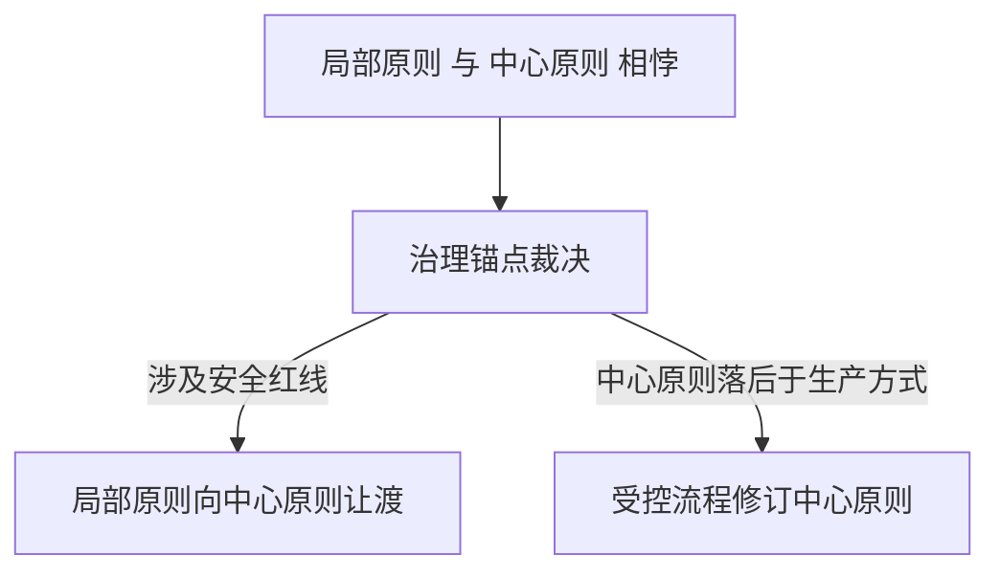
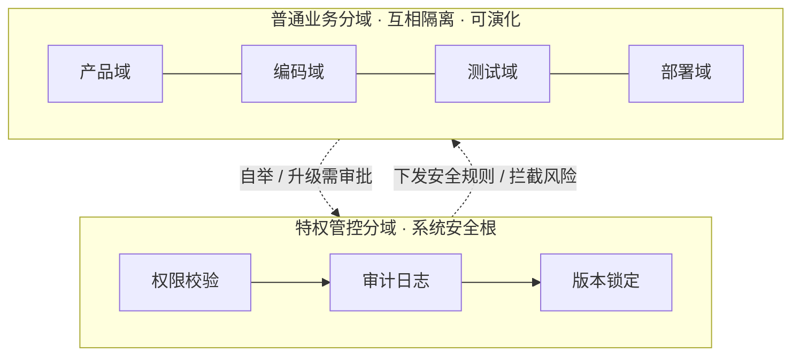
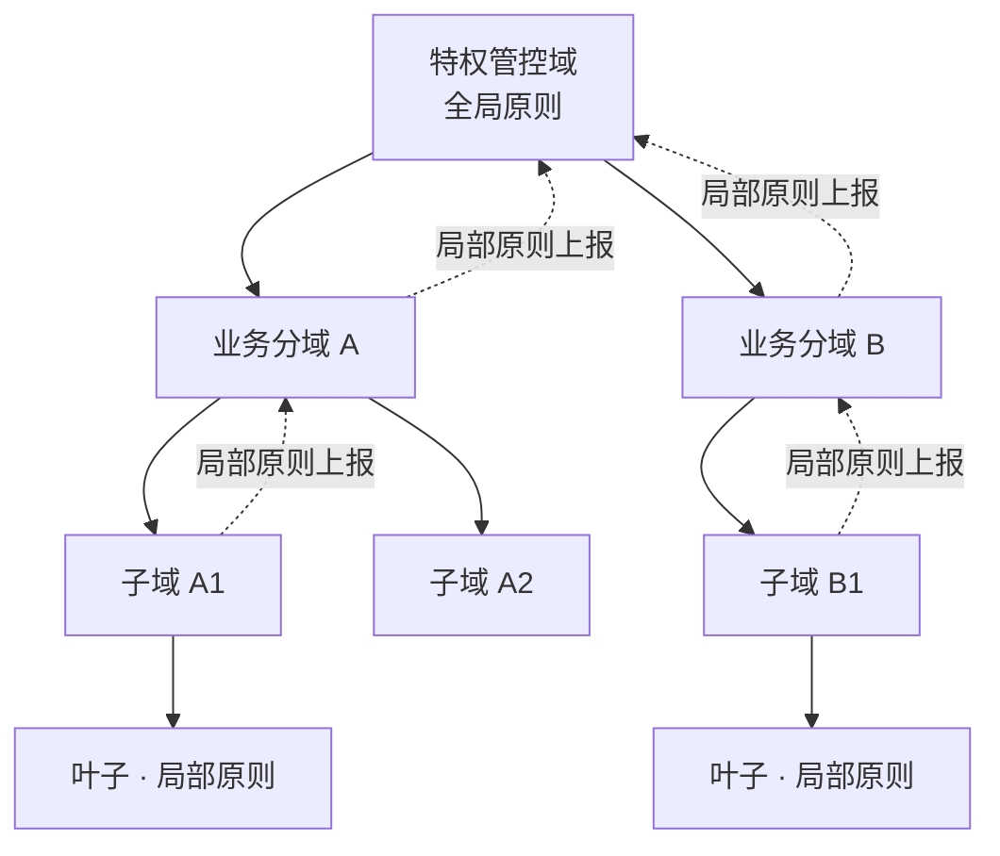
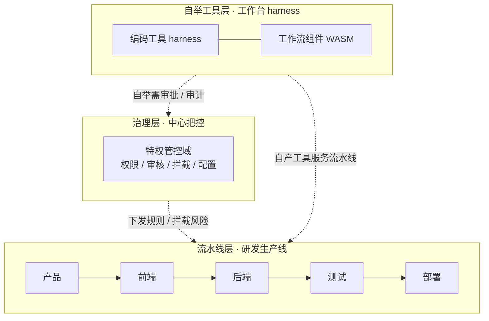
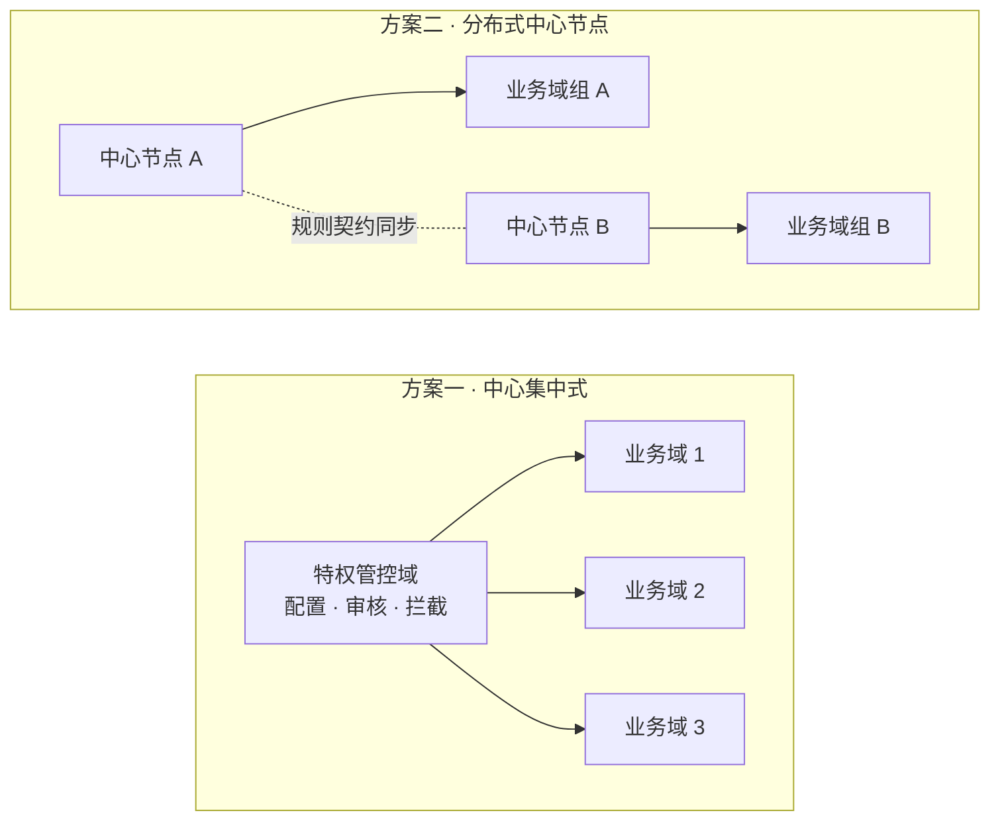
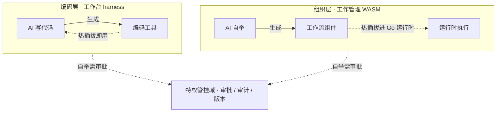

# 分域受控自举智能体架构 · 原创范式白皮书（2026）

> 作者：CanWeakerWriteStrongCode

## 1. 文档说明与版本说明

本文档是2026年由作者独立构思的智能体架构设计范式，也是分域受控自举智能体架构的官方设计文档。

文档固定了这套架构的底层规则、域划分标准、安全约束和扩展逻辑。后续所有代码开发、版本迭代、功能拓展、场景落地，都要遵循这套核心定义，不会推翻底层架构。

需要说明的是：本文档描述的是本范式的**完整设计目标**与底层规则，不等同于当前代码已实现的能力；实现进度与版本计划见项目 README。

文档版本：v0.1 最终定稿（范式锁定）

文档日期：2026-08-21

对应开源项目：domain-separated-self-boot-agent-runtime

## 2. 架构正式名称与定位

- 产品代号：BaijiMind（白鳍豚心智）
- 别称：DolphinMind（海豚心智）
- 中文名称：分域受控自举智能体架构
- 英文名称：Domain-Separated Controlled Self-Boot Agent Architecture

核心定位：专门适配企业研发、自动化办公、智能生产场景的AI智能体架构，核心特点是「AI可以自我升级，但全程可控、安全不失控」。其普遍思想内核见 §3。

## 3. 思想内核：一种通用的自主生产组织范式

“分域受控自举”不只是一种软件架构，更是一套**通用的系统组织思想**。它要回答的问题是：**当一个系统需要大规模自主生产，又必须保证不失控时，该怎么组织？**

### 3.1 两个前提：AI 与人同为生产主体与认知主体

在未来的生产方式中，AI 与人**同为生产主体、同为认知主体**——都参与思考与决策，都在生产中起作用，分工不同而非高下不同：

- **AI 的主体性在生产执行**：承担大规模、高并发的生产执行，自组织流水线、自我生产工具，主导生产的进化
- **人的主体性在目标与责任**：人同时是设计师与检查师——设定生产目标、设计并审查 AI 的成果、把守规则红线、承担最终责任

二者还有一处根本的速度不对称：**AI 的迭代速率远超人类**，且随着自举能力走向成熟，这一差距在未来很可能进一步拉大。AI 的自举可以在极短时间内完成一轮自我改进——生成工具、改造流程、甚至修订局部原则；而人类制度与观念的更新以年计。这正是“受控自举”存在的原因：进化的速度越快，越需要治理锚点把住方向——否则高速自举就是高速失控。

主体不分高下，但**责任有锚点**：治理锚点与中心原则的最终修订权，归于人（或人设计的受控流程）——这正对应 §3.2 的辩证关系。以当下的价值观为基准，**人仍是责任主体**：最终责任由人承担，不因 AI 在生产中的主体地位而让渡；责任归属是否会随社会观念的演进而调整，本范式暂不预设。

### 3.2 一个辩证内核：生产力与生产关系

AI 的自举——自我生产工具、自组织流程——是系统进化的**生产力**；治理层（中心原则）是约束生产力运行方式的**生产关系**。二者构成辩证关系：

- **生产力推动生产关系**：新的生产方式不断涌现，会持续推动中心原则的修订——治理规则必须随生产方式演化，不能僵化
- **生产关系指引并约束生产力**：中心原则约束 AI 的自举、防止失控，同时**指引生产的方向**——划定边界与优先级，把自主进化导向既定目标
- **中心原则的修订本身受控**：由人类或受控流程发起，而非任由 AI 无约束地自我修改——这正是“受控自举”中“受控”二字的含义

一句话抽象：**“单元自治进化，治理锚定可控。”**——即愿景中的：**智能自由生长，秩序永久可控。**

自举与治理的交替否定，推动系统**螺旋式上升**：自举倒逼治理升级，治理又为更大胆的自举松绑——二者互为阶梯，而非静止的平衡。

### 3.3 三条结构性内核

1. **域分离**——把系统拆分成互相隔离、职责清晰的独立单元（域）。单元之间不裸奔、不越界，故障不扩散、混乱不蔓延。
2. **受控自举**——允许每个单元自主改进自身能力：生成新工具、新流程、新能力，甚至生成该单元独有的**局部原则**。自举是系统进化的动力，但必须发生在治理边界之内。
3. **治理锚点**——系统需要一个（或一组）治理域作为“锚点”，统一把控规则、权限、审核、拦截，保证“自由不失控”。

当**局部原则**与**中心原则**相悖时，交由治理锚点裁决，按两条准则处理：涉及安全红线的，局部原则向中心原则让渡；若中心原则已落后于新的生产方式，则通过受控流程修订中心原则——这正是 §3.2“生产力推动生产关系”的落地。

### 3.4 载体：一种思想，多种落地方案

这套思想可以落到任何“自主生产 + 可控治理”的系统上，每一种落地方案就是一个**载体**：

- **载体一：企业软件研发**——AI Agent 在受控分域中完成产品、编码、测试、部署全流程，通过插件化 harness 自我改进。当前 v0.1 demo 即此载体。
- **载体二：社会化大规模机器人自主生产**——机器人、产线与工厂集群作为生产域，受治理中心把控，在受控边界内自主进化。远期形态。
- 载体不限于此：自动化办公、智能生产调度……凡需“自主生产 + 可控治理”的场景，皆可套用同一范式。

下文以**载体一（企业软件研发）**为主线展开架构细节，其余载体按同一范式适配，无需重构底层设计。

## 4. 产品定位

本节以载体一（企业软件研发）为落地场景，阐述这套思想落地时面对的行业背景与商业选择。

### 4.1 商业背景

当前市面 AI 智能体，大多数智能体框架都偏向一端：要么偏重**自由式自举**——能自我生成、能迭代、能改造流程，却缺少底线管控；要么偏重**限制式管控**——把 AI 锁进固定流程，安全有了，却牺牲了自我进化。前者的失控倾向，制造了一个核心商业矛盾——**AI 越聪明、越自举，企业越不敢上线生产**：无隔离、无权限域、无规则锁、无审计、无兜底，本质是**完全自由自举**，不受任何约束——恰与“受控自举”相对。

企业真实需要的是：**让 AI 成为企业的「大脑」与「双手」**——大脑承担需求理解、任务规划、生产决策与流程编排，双手承担大规模、高并发的生产执行与制品产出；同时拥有人类可控的安全底线——这套脑手体系**可审、可拦、可回滚**，这正是愿景中「智能自由生长，秩序永久可控」的工程含义。

而「大脑」要思考得好，前提是**读得懂项目**：借助 IM / 邮件与文档上传，需求、评审、变更与历史决策自然流入，AI 持续获取并更新项目上下文——而非只收到一句脱离语境的抽象需求。

### 4.2 行业核心痛点

1. **智能失控**：Agent 可随意改配置、改流程、改代码，自举完全自由，存在自残、越权风险
2. **隔离不足**：项目与项目、需求与需求之间缺乏硬隔离，改动相互串扰、越界执行，极易线上翻车
3. **治理缺失**：没有全局管控中心，权限散乱、无法审计、无风险追溯
4. **迭代无序**：自举无约束、功能扩展无规范，系统越用越失控，无法长期运维
5. **衔接不畅**：团队、项目级别的生产衔接不够丝滑——需求转手、跨角色交接依赖大量人工协调，流转慢、返工多。而 AI 响应快、可 7×24 接力作业，天然适配高速流转，缺的正是这套受控的组织化编排来把它释放出来

本范式以分域隔离 + 受控自举 + 特权分层管控，系统性回应以上行业痛点，兼顾灵活性和安全性。需要说明的是：**范式目标不等同于当前已实现**——v0.1 优先落地「衔接不畅」的流转丝滑，以及 AI 修改工作流 / 新增脚手架时的审批式自举；其余痛点随版本演进逐步覆盖（见 README Roadmap）。

### 4.3 项目愿景

打造一套 **「可控自由」的企业级智能体运行时**——让 AI 拥有**白鳍豚式集群协同与自适应能力**，同时拥有**中心规则锚点**。

最终实现：**智能自由生长，秩序永久可控。**

在这套体系中，人始终是**设计师、检查师与最终审批者**：AI 自由生长，人在环中把守边界、审批自举——生长与把守互为阶梯，推动系统螺旋式上升。

让智能体真正可以落地企业研发、自动化生产，从演示阶段走进生产阶段。长远来看，或许这套范式不止于软件研发——**社会化大规模机器人自主生产**同样可以用类似的架构组织：中心把控全局规则与红线，各生产单元分层受控、自治进化，在受控边界内持续自举。

## 5. 三大核心设计原则（架构原创核心）

### 原则一：所有功能、环境全部分域隔离（全域皆域）

系统里所有运行功能、模块、线上环境，全部拆分成独立的“可信域”。没有裸奔、无边界的代码，从根源避免功能混乱、环境互相干扰、故障扩散。

### 原则二：AI自我升级必须受约束（自举必须受控）

AI智能体自己生成代码、新增功能、修改工作流、迭代自身能力，统称为“自举”。自举以**插件化 harness** 为落地形态（见 §6.3）：AI 一边使用这套工具完成工作，一边通过插件机制不断改进工具本身——用工具的同时，制造更好的工具。在工程上，编码工具经 **harness 热插拔**、工作流等组织组件经 **WASM 热插拔**（见 §8.4）。和市面上自由散漫的AI自举不同，本架构所有自举行为，都要经过权限校验、安全审核、版本锁定，防止AI乱改、自残、越权操作。

### 原则三：生产环境严格隔离，只出不进（制品强隔离）

AI创作、开发、生成代码的工作台，和线上正式生产环境完全分开。AI只能输出代码、插件、配置等“成果制品”，不能直接修改、操作线上生产系统，避免AI搞崩业务。

## 6. 核心域模型设计（架构原创亮点）

本架构的核心思路就是全系统分域运行，所有模块都是独立的域，统一规则、统一标准，只是分工和权限不一样。分域不是扁平堆叠，而是**纵向分层**：从中心治理，到业务流水线，再到自举工具，层层受控、层层可演化。

重点原创设计：传统架构的“中心管控”，不是独立模式，只是分域体系里一个权限更高的特殊域。整套架构统一、不割裂，可灵活扩展。

以上是**中心式**域组织——一个特权管控域直管多个业务分域。域模型还有**树状节点式**形态：域逐级嵌套为树，治理沿树分布，每个节点在上级原则之内持有自己的**局部原则**：

树状节点式是从中心式走向全对等（见 §7）的中间形态：树的层级越深、治理节点越多，就越接近分布式中心。局部原则冲突时沿树逐级上报，交由上级治理节点裁决（见 §3.3）。这种结构与「总部—区域分部」的治理关系同构：总部确立全局原则，区域分部在总部制度框架内拥有自治权、可制定区域规程，但不得与上位制度相抵触；冲突时上位制度优先，局部向中心让渡。

### 6.1 特权管控分域（系统安全根）

整个系统唯一的最高可信管控域，相当于系统的“安全管理员+规则锁”，核心能力如下：

- 统一校验所有操作权限、记录审计日志、锁定核心版本
- 禁止AI自我修改、篡改核心规则，防止底层失控
- 管控所有业务域的AI自举、功能升级、能力拓展行为
- 制定系统安全规则、分发运行策略、拦截风险操作

### 6.2 普通业务分域（实际工作的可演化模块）

负责具体业务的独立运行域，是真正落地功能、执行任务的单元，支持AI自主迭代升级：

- 支持AI插件式自举，自动新增业务功能、迭代优化能力
- 各业务域互相隔离，一个域出问题，不会影响整个系统
- 支持按需增删、扩容、缩容，适配不同规模的业务需求

### 6.3 分层结构：治理层 · 流水线层 · 自举工具层

本架构的分域呈纵向分层，核心是三段式（可按需扩展为多层）：

- **治理层（特权管控域）**：统一把控权限、审核、拦截、配置，是系统安全根，全系统唯一的最高可信域
- **流水线层（业务分域）**：业务分域组成研发“生产线”——产品 → 前端 → 后端 → 测试 → 部署，类比工业生产的流水线建设。流水线既可**编排**也可**自组织**：编排由治理层与人工定义阶段与流转，保证稳定；自组织由 AI 在受控边界内自行重组流程，带来进化
- **自举工具层（插件化 harness，工作台）**：工作台是 harness 与自产工具的承载环境。AI 在工作台上写代码，使用 harness 工具（如 DeepSeek-Harness 一类）完成工作，并**自我产生新的编码工具**——一边用工具，一边改进工具；这些编码工具以 **harness 热插拔工具**形式注册进工作台，可回收、可沉淀、可随用随弃。自举的另一层面是**工作组织**：AI 新增或修改**工作流**时，以 **WASM 插件**形式热插拔进运行时（见 §8.4）

分层不限于三层，可按业务复杂度扩展为多层；层与层、域与域之间通过统一域模型和受控契约交互，全部自举行为由治理层统一审计。当某域的局部原则与治理层中心原则相悖时，同样经此受控契约交由治理层裁决（裁决准则见 §3.3）。

中心把控是默认形态，但不是唯一形态——治理能力可随系统演进为分布式中心配置、分布式把控（见 §7 双形态演进）。

## 7. 双形态演进：一套架构适配所有场景

本架构的一大核心优势：一套底层逻辑，支持两种运行形态，从小团队小项目，到大型分布式集群都能适配，不用重构架构。

### 7.1 收敛形态：中心-分域模式（当前v0.1落地版本）

由1个特权管控域 + 多个业务分域组成，中心化统一管理、分工运行。

- 适用场景：中小企业研发工作流、团队自动化办公、日常AI任务调度
- 核心优势：结构简单、落地成本低、安全规则清晰、风险完全可控

### 7.2 泛化形态：全分域对等模式（远期扩展形态）

取消固定唯一中心，所有域地位对等，通过统一契约和权限规则互相约束、协同运行。管控能力也可随域对等分布——由多个治理中心**分布式配置、分布式把控**，而非唯一中心集中把控。

- 适用场景：大型分布式集群、工业智能机器人集群、社会化全自动生产系统
- 核心价值：去中心化、无单点中心瓶颈，具备向超大规模横向扩展的能力

### 7.3 治理形态探讨：中心集中 vs 分布式中心节点

治理层（特权管控域）的排布方式是一个独立的设计选择，两种典型方案：

**方案一：中心集中式治理**——一个特权管控域作为唯一中心，统一配置、统一审核、统一拦截。当前 v0.1 即采用此方案（即 §7.1 收敛形态）。

- 优势：规则唯一、审计集中、实现简单、风险面小
- 局限：单点中心存在瓶颈与故障风险；跨地域、超大集群场景下治理链路长

**方案二：分布式中心节点治理**——治理能力由多个中心节点承载，各节点分布式配置、分布式把控，通过统一契约保持规则一致。

- 优势：无单点瓶颈、可跨地域就近治理、能随规模横向扩展
- 局限：需要一致的规则分发与同步机制，治理一致性（强一致 / 最终一致）是核心难点

树状节点式（§6）与分布式中心可结合——树的内部治理节点即分布式中心，顶层保留全局锚点，形成“分层自治”的混合形态。

裁决差异：中心集中式由唯一治理锚点裁决；分布式中心模式下，由中心节点群**依统一契约共同裁决**——契约是全局规则一致性的唯一来源（见 §3.3）。

两个方案不是二选一的对立关系，而是同一演进路径上的不同阶段，与 §7.2 的全分域对等共同构成完整的治理形态谱系：**中心集中 → 分布式中心 → 对等无中心**。系统从小到大演进时，治理形态逐级放宽，底层范式与域模型始终不变。

## 8. 两套技术体系：工程落地路线

本节是载体一（企业软件研发）的工程落地路线。

市面上绝大多数 Agent 框架只做「功能堆叠」，不做工程架构分层与语言边界定义。这导致项目做到后期：业务乱、性能乱、权限乱、部署乱、迭代失控。

本架构在设计之初，就同时预留两套生产级落地体系：

- 体系A：Java + Golang 混合分层架构（稳重企业版）
- 体系B：Golang 全栈统一架构（轻量云原生版）

两套体系架构思想完全统一、域模型完全兼容、能力对齐，只是底层技术栈分工不同。这也是本架构区别于仅停留在功能演示的项目的关键工程差异：不仅有 AI 范式创新，还预留了清晰的长期工程演进路线。

### 8.1 两门语言的底层差异（架构设计核心依据）

所有架构分层、域拆分、职责划分，本质都是顺应两门语言的特性扬长避短。

| 维度 | Java / Spring 生态 | Golang |
| --- | --- | --- |
| 特性定位 | 重、稳，复杂业务建模强、企业治理强 | 轻、快，并发强、云原生，天然适配自举与 WASM 热插拔 |
| 核心优势 | 复杂业务治理、事务、权限、流程、领域建模、规范体系；生态成熟、工具链完善，适合长期迭代的复杂业务域 | goroutine 轻量级并发模型、静态单文件部署、毫秒级启停、**WASM 热插拔**（wazero / wasmtime 等运行时）、极低运维成本，非常适合「大量动态生成、动态销毁、动态调度」的自举式任务 |
| 短板 | 启动慢、容器重、部署笨重、高并发吞吐成本高，不适合高频轻量调度与短生命周期任务 | 复杂业务建模、多层流程治理、事务体系不如 Java 厚重成熟，不适合承载极度复杂、频繁变更的企业核心业务规则 |

### 8.2 体系A：Java-Golang 混合架构（企业主推生产形态）

核心思想：**Java 扛规则、Golang 扛执行；Java 做管控域、Golang 做业务自举域。**

#### Java 承载：特权管控域（全局核心层）

将变动少、核心、安全、治理的能力交给 Java Spring 体系承载：

- 全局权限校验、安全基线策略
- 用户体系、角色、资源、权限 RBAC 治理
- 审计日志、风险拦截、版本锁定
- 工作流核心规则、流程审批、事务一致性
- 系统配置、全局参数、白名单、风险黑名单

架构意义：特权管控域绝对不能轻飘、不能随意重启、不能动态乱改。Java 的稳重特性更能守住「系统安全根」，符合本架构公理：核心规则禁止无约束自举篡改。

#### Golang 承载：业务分域 + 自举运行时（动态执行层）

把所有动态、可变、频繁调度、自举生成、启停销毁、执行交给 Golang：

- Agent 任务调度、队列消费、批量执行
- 动态插件加载、自举能力注册与销毁
- 多域并行执行、域隔离资源调度
- 短周期自动化任务、临时工作流执行
- 云原生容器部署、弹性扩缩容

架构意义：业务域需要频繁生长、迭代、伸缩、销毁，Golang 轻量高速的特性天然适配「可控自举」。

#### 核心价值

以 Java 的稳重补齐 AI 项目普遍缺失的治理与安全底线，以 Golang 的轻快补齐传统 Java 项目并发弱、自举难的短板——管控稳重、业务灵活，中心不动、外围可自举演化。

### 8.3 体系B：Golang 全栈架构（轻量云原生版）

核心思想：一套 Golang 运行时，同时简化实现管控域 + 业务域，统一技术栈、消除跨栈成本。

#### 适用场景

- 轻量化自动化、个人/小团队集群与边缘私有化部署
- 追求极低运维成本、单二进制、无 JVM 依赖，无需超复杂权限治理的场景

#### 架构取舍

全 Go 架构的优势是统一、简单、轻快、云原生。代价是：需要自行封装复杂权限体系、审计体系、流程体系，生态不如 Java 成熟。

所以本架构定位：

- 全 Go 版本 = 轻量化范式验证 & 边缘云原生形态
- Java + Go 混合版本 = 正式企业生产级形态

### 8.4 受控自举的工程机制：编码走 harness，组织走 WASM

受控自举在工程上分两个层面，各用一套机制：

#### 编码层（工作台）：harness 热插拔工具

AI 在工作台上写代码时使用 harness（如 DeepSeek-Harness 一类）完成工作，自我产生的编码工具以 **harness 热插拔工具**形式即时注册进工作台。harness 热插拔的核心优势：

- **即时生效**：新工具即刻可用，无需重启服务、不打断生产
- **边用边改**：AI 在工具使用中发现问题，可当场生成改进版并热替换——用工具的同时，制造更好的工具
- **随用随弃**：临时工具用完即弃，不污染工作台；确有价值的沉淀复用
- **自举闭环**：AI 用自造工具完成更复杂的任务，再在任务中造更新的工具——工具能力随任务螺旋上升（见 §3.2）

#### 组织层（工作管理）：Go + WASM 热插拔插件

业务分域以微服务形态运行。AI 自举到工作组织层面——新增或修改**工作流**、流程编排、流水线阶段——这些结构性组件以 **WASM 插件**实现：

- 编译为 WASM（WebAssembly）模块，通过 wazero / wasmtime / wasmedge 等运行时**热插拔**进 Go 服务——无需重启、即时生效
- WASM 天然具备沙箱隔离（内存与宿主隔离）——这正是“域隔离”的工程形态
- 插件可签名、可版本化、可审计，配合审批门——构成“受控自举”的完整闭环
- 跨语言：AI 可用任意语言生成插件，编译为 WASM 统一接入

一句话：**编码工具走 harness，工作组织走 WASM**——沙箱即隔离、热加载即自举、签名与审批即受控。

两套自举机制各自落在专属的域内：编码工具的自举在工作台（编码域），工作流的自举在工作组织域。**自举本身也按域隔离**——各域以各自机制自举，互不越界、互不干扰。这正是分域思想在自举机制上的体现（见 §3.3）。

### 8.5 两套体系统一的架构核心规则（关键归一设计）

无论选哪种技术栈，分域受控自举范式完全不变，这是架构可长期演进的核心底气。

- 域模型不变：特权管控域 / 业务分域 模型统一
- 自举约束不变：所有自举行为必须受控、可审计、可拦截
- 制品隔离不变：生产域只进结果、不进修改
- 双拓扑演进不变：支持中心收敛形态 / 对等泛化形态

### 8.6 技术体系结论

1. Java-Golang 混合架构是本项目的主推生产形态，针对「AI 智能失控 + 企业治理缺失 + 性能弹性不足」三类问题给出了统一的工业化解法
2. Golang 全栈架构作为轻量化备选形态，负责极简部署、边缘场景、快速验证范式
3. 技术栈分层不是随意选型，而是匹配分域架构动静分离、治理与执行分离的深度思考——双栈兼容、各司其职，工程系统性优于单一技术栈的框架

以上体系在工程上兑现为：自举全程可追溯、可拦截、可回滚，生产域只接收经审批的制品——安全可控与生产可用落实在工程机制上。

## 9. 扩展：人类组织，一个天然的先行载体

这套范式并非凭空设计——它有一个经过数千年试错验证的天然先例：**人类组织**。公司、机构、社会，本质上都是“分域 + 受控自举 + 治理锚点”的实例，与 §3 思想内核一一对应：

| 本范式 | 人类组织的对应 |
| --- | --- |
| 域分离 | 部门与专业分工：各司其职、故障隔离 |
| 治理锚点 | 管理层 / 公司章程：统一把控规则、权限、审计 |
| 受控自举 | 组织内的创新与变革：新流程、新工具，经审批与合规 |
| 局部原则 vs 中心原则 | 区域规程 vs 公司章程：冲突交由制度审查裁决 |
| 中心集中 → 分布式中心 → 对等 | 集中管控 → 分权管理 → 事业部制 / 网络型组织 |
| 生产力与生产关系辩证 | 哲学对人类社会组织形态的刻画 |

范式收敛于人类组织的形态，恰恰说明它抓住了复杂生产系统的组织规律。因此**人类组织可视为“载体零”**——一个预先存在、持续运行、可用于验证本范式的天然实例（载体概念见 §3.4）。

同时，AI 生产系统与人类组织存在本质差异，这些差异正是“受控自举 + 治理锚点”存在的原因：

- **进化速度**：AI 自举毫秒级迭代，人类制度以年计的惰性——受控自举的约束远重于人类的变更管理
- **规模与可替换性**：AI 分域可瞬间生成、销毁，域是廉价可耗材；人类部门难以任意增减。这带来微服务原理（**康威定律**：系统架构复制组织的沟通结构）的反转——人类组织里「代码边界随组织边界」是刚性耦合，改代码结构得先改组织结构；而本范式中的域可随时重建，**域边界可自由对齐服务边界**，组织与代码的刚性耦合被解耦
- **激励 vs 对齐**：人类组织有利益集团、寻租与委托代理问题；AI 单元对应目标错配与 specification gaming——组织政治被对齐问题替代
- **结构性失效**：动机驱动的失效模式（报喜不报忧、寻租、制度惰性）在纯机器系统里基本消失，但结构性问题原样保留——**局部自治与全局一致不可兼得**，只能持续调和（见 §7.3）；规则未覆盖的例外需要临场判断，而机器恰恰缺乏人的这种即兴能力；人类作为最终审批者的「橡皮图章」风险，不因节点是机器而减轻。此外机器系统还引入人类组织没有的**意外自残**：自举路径上的普通 bug 也可能无意写坏自身引导代码，无需任何恶意
- **责任**：人类组织最终问责到自然人；AI 生产下，“以当下价值观为准，人仍是责任主体”（见 §3.1）承担这一角色

## 附录 A：思想脉络与相关研究

### A.1 作者的思想脉络（独立构思过程）

1. **起点——AI 与人是共同主体**：AI 与人都将成为生产与认知的主体——AI 承担大规模生产执行与自主进化，人作为设计师与检查师设定目标、审查成果、承担最终责任
2. **启发——DeepSeek Harness**：受 DeepSeek Harness「一切皆插件」理念启发——AI 在使用工具的同时，可以改进工具本身
3. **推演——自组织生产**：由此推断，AI 在生产中自组织流水线、自我生产工具，是水到渠成之事
4. **约束——中心原则**：但 AI 改造生产环境时，必须受到中心原则的限制
5. **辩证——生产力与生产关系**：新的生产方式又会反过来推动中心原则不断修订——正如生产力与生产关系之间的辩证运动
6. **收敛——范式成型**：以上独立推演最终收敛为本范式：分域 + 受控自举 + 治理锚点

### A.2 与相关研究的对照

2025–2026 年，学界与企业界围绕“受控 / 章程式自进化 Agent”出现了一波独立收敛（如章程式自进化、递归自改进、多中心治理等）。本范式与它们同向，独立亮点在于：

- **以生产组织为首要透镜**：多数工作聚焦 AI 安全治理（防失控），本范式聚焦生产系统如何组织——产线、单元与治理
- **受控自举 + 治理锚点一级并立**：自举不是附属能力，而是与治理同级的架构支柱
- **自举按域隔离、两通道落地**：编码工具经 harness 热插拔，工作流等组织组件经 WASM 热插拔，各自落在专属域内
- **跨载体尺度统一**：从企业软件研发到社会化机器人生产，同一范式自相似复现
- **生产力 / 生产关系辩证**：自举与治理在交替否定中螺旋式上升，而非静态平衡

上述综合——以生产组织为透镜、自举与治理一级并立、跨载体自相似——据作者检索未见先例。任何方向性近似，属独立收敛而非参考。

## 10. 文档原创声明与版权说明

本架构的核心设计思想、分域模型、受控自举规则、双形态演进体系均由作者独立构思、独立设计并撰写完成。作者为独立开发者，创作过程中未参考或复制任何单一现成框架；如与既有研究存在方向性近似，属独立收敛而非参考（见附录 A）。本文档及其所属 GitHub 仓库构成作者对该思想体系的公开、带日期记录（v0.1，2026-08-21）。

本文档的术语标准化、文字梳理、排版润色由AI工具辅助完成，核心原创逻辑完全归作者所有。

开源协议说明：项目代码基于 MIT 协议开源，可自由使用、修改、二次开发。

原创权益保留：架构设计理念、核心范式、文档内容不允许洗稿、篡改、冒充原创，保留全部著作权。

© 2026 CanWeakerWriteStrongCode · 分域受控自举智能体架构 原创范式
