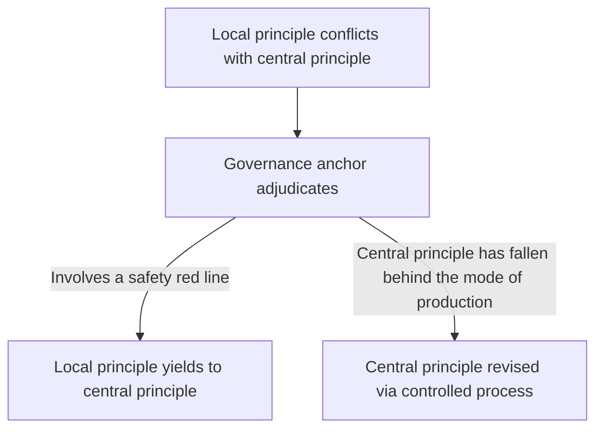
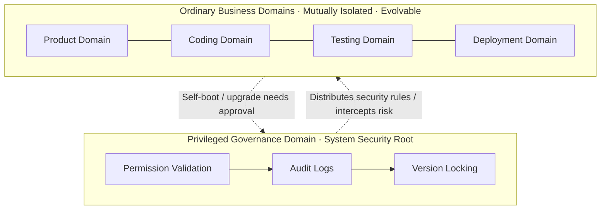
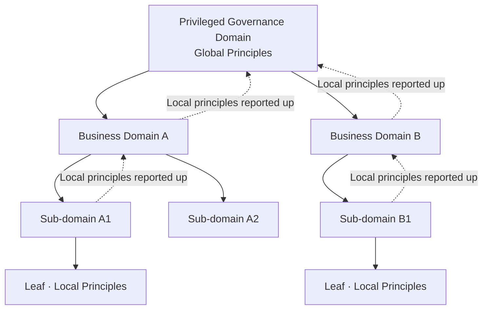
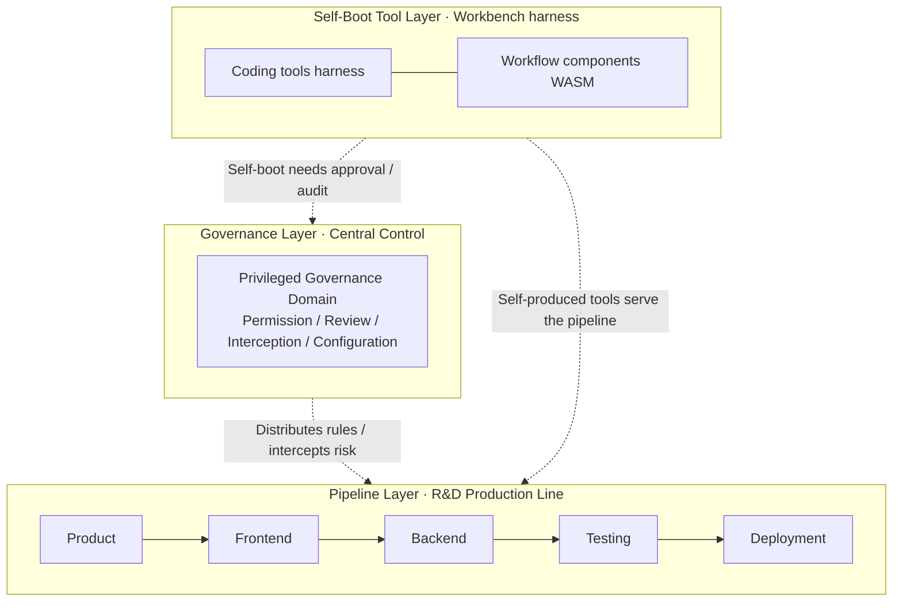
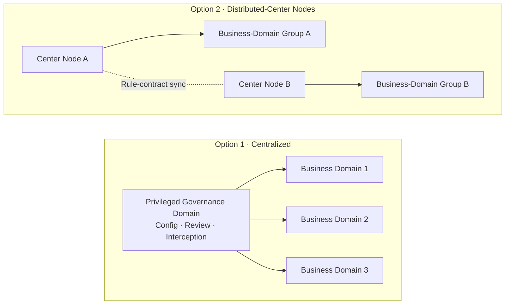
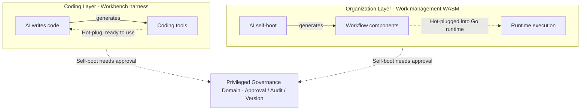

# Domain-Separated Controlled Self-Boot Agent Architecture · Original Paradigm Whitepaper (2026)

> Author: CanWeakerWriteStrongCode

> Translation note: This is an English translation of the original Chinese whitepaper ([`docs/original-2026-paradigm.md`](original-2026-paradigm.md), v0.1, 2026-08-21). The Chinese original is the authoritative version; in case of any discrepancy, the Chinese version prevails.

## 1. Document Description and Version

This document is an agent-architecture design paradigm independently conceived by the author in 2026, and the official design document of the Domain-Separated Controlled Self-Boot Agent Architecture.

The document fixes the architecture's underlying rules, domain-division criteria, security constraints, and extension logic. All subsequent code development, version iteration, feature expansion, and scenario deployment must follow these core definitions and will not overturn the underlying architecture.

It should be noted that this document describes the paradigm's **complete design goals** and underlying rules, not the capabilities already implemented in code; implementation progress and version planning are in the project README.

Document version: v0.1 — paradigm finalized

Document date: 2026-08-21

Corresponding open-source project: domain-separated-self-boot-agent-runtime

## 2. Official Name and Positioning

- Product codename: BaijiMind (白鳍豚心智)
- Alternate name: DolphinMind (海豚心智)
- Chinese name: 分域受控自举智能体架构
- English name: Domain-Separated Controlled Self-Boot Agent Architecture

Core positioning: an AI-agent architecture tailored for enterprise R&D, automated office work, and intelligent production scenarios. Core characteristic: **AI can self-upgrade, but is controllable at all times and never loses safety**. Its general conceptual core is in §3.

## 3. Conceptual Core: A Universal Organizational Paradigm for Autonomous Production

"Domain-separated controlled self-boot" is not merely a software architecture — it is a **general system-organization idea**. The question it answers: **when a system needs large-scale autonomous production while guaranteeing it never spirals out of control, how should it be organized?**

### 3.1 Two Premises: AI and Humans as Both Production Subjects and Cognitive Subjects

In the future mode of production, AI and humans are **both production subjects and cognitive subjects** — both participate in thinking and decision-making, both act in production, differing in division of labor rather than rank:

- **AI's subjectivity lies in production execution**: undertakes large-scale, high-concurrency production execution; self-organizes pipelines, self-produces tools, and leads production evolution
- **Human subjectivity lies in goals and responsibility**: humans are simultaneously designers and inspectors — setting production goals, designing and reviewing AI's output, guarding rule red lines, and bearing ultimate responsibility

There is also a fundamental asymmetry in speed: **AI's iteration rate far exceeds that of humans**, and as self-boot capability matures, this gap will likely widen further. AI self-boot can complete a round of self-improvement — generating tools, reshaping processes, even revising local principles — in an extremely short time, while human institutions and ideas update on a scale of years. This is precisely why "controlled self-boot" exists: the faster the evolution, the more a governance anchor is needed to hold the direction — otherwise high-speed self-boot is high-speed loss of control.

Subjects are equal in rank, but **responsibility has an anchor**: the ultimate revision power of the governance anchor and central principles rests with humans (or human-designed controlled processes) — this corresponds to the dialectic in §3.2. Under current values, **humans remain the responsible subject**: ultimate responsibility is borne by humans and is not delegated away by AI's subjecthood in production; whether responsibility attribution will adjust as social values evolve is not presupposed by this paradigm.

### 3.2 A Dialectical Core: Productive Forces and Relations of Production

AI's self-boot — self-producing tools, self-organizing processes — is the **productive force** of system evolution; the governance layer (central principles) is the **relations of production** constraining how the productive forces operate. The two form a dialectical relationship:

- **Productive forces drive the relations of production**: new modes of production continually emerge and keep pushing revision of central principles — governance rules must evolve with the mode of production, not become rigid
- **The relations of production guide and constrain the productive forces**: central principles constrain AI's self-boot and prevent loss of control, while also **guiding the direction of production** — delimiting boundaries and priorities and steering autonomous evolution toward set goals
- **Revision of central principles is itself controlled**: initiated by humans or controlled processes, not left to unconstrained self-modification by AI — this is the meaning of "controlled" in "controlled self-boot"

In one sentence: **"Units evolve autonomously; governance anchors keep control."** — that is, the vision: **intelligence grows freely, order remains permanently controllable**.

The alternating negation of self-boot and governance drives the system in **spiral ascent**: self-boot forces governance to upgrade, and governance in turn relaxes constraints for bolder self-boot — the two are mutual ladders, not a static equilibrium.

### 3.3 Three Structural Core Elements

1. **Domain separation** — decomposes the system into mutually isolated, clearly-responsible independent units (domains). Units do not run exposed and do not cross boundaries; faults do not spread and chaos does not propagate.
2. **Controlled self-boot** — allows each unit to autonomously improve its own capability: generating new tools, new processes, new capabilities, and even the unit's own **local principles**. Self-boot is the engine of system evolution, but must stay within governance boundaries.
3. **Governance anchor** — the system needs one (or a group of) governance domains as its "anchor," uniformly controlling rules, permissions, review, and interception, guaranteeing "freedom without loss of control."

When a **local principle** conflicts with a **central principle**, the governance anchor adjudicates, following two criteria: if a safety red line is involved, the local principle yields to the central principle; if the central principle has fallen behind new modes of production, the central principle is revised through a controlled process — this is exactly the "productive forces drive the relations of production" of §3.2.

### 3.4 Carriers: One Idea, Many Landing Forms

This idea can land on any "autonomous production + controlled governance" system; each landing form is a **carrier**:

- **Carrier One: enterprise software R&D** — AI agents complete the full product, coding, testing, and deployment pipeline within controlled domains, self-improving through plugin-based harness. The current v0.1 demo is this carrier.
- **Carrier Two: large-scale socialized autonomous robot production** — robots, production lines, and factory clusters serve as production domains, governed by a governance center and evolving autonomously within controlled boundaries. A long-term form.
- Carriers are not limited to these: automated office work, intelligent production scheduling… any scenario requiring "autonomous production + controlled governance" can apply the same paradigm.

Below, the architecture details follow **Carrier One (enterprise software R&D)** as the main line; other carriers adapt to the same paradigm without redesigning the underlying architecture.

## 4. Product Positioning

This section uses Carrier One (enterprise software R&D) as the landing scenario, elaborating the industry background and commercial choices facing this idea when it lands.

### 4.1 Commercial Background

Today's AI agents — most agent frameworks — lean toward one extreme: either **free-form self-boot** — able to self-generate, self-iterate, and reshape processes, but lacking baseline control; or **constrained control** — locking AI into fixed processes, achieving safety but sacrificing self-evolution. The former's loss-of-control tendency creates a core commercial contradiction: **the smarter and more self-booting the AI, the less willing enterprises are to put it into production** — no isolation, no permission domains, no rule locks, no audit, no fallback — in essence, **completely free self-boot**, subject to no constraints — precisely the opposite of "controlled self-boot."

What enterprises truly need: **making AI the enterprise's "brain" and "hands"** — the brain handles requirement understanding, task planning, production decision-making, and process orchestration; the hands handle large-scale, high-concurrency production execution and artifact output; while keeping a human-controllable safety baseline. This brain-and-hands system is **auditable, interceptable, and rollback-able** — the engineering meaning of the vision "intelligence grows freely, order remains permanently controllable."

And for the "brain" to think well, a prerequisite is **understanding the project**: through IM/email and document uploads, requirements, reviews, changes, and historical decisions flow in naturally, and AI continuously acquires and updates project context — rather than receiving only an abstract requirement stripped of context.

### 4.2 Industry Core Pain Points

1. **Runaway intelligence**: agents can arbitrarily modify configuration, processes, and code; self-boot is completely free, posing risks of self-harm and privilege escalation
2. **Insufficient isolation**: lack of hard isolation between projects and between requirements; changes interfere with each other and cross boundaries, easily causing production incidents
3. **Missing governance**: no global governance center; scattered permissions, no auditability, no risk traceability
4. **Disorderly iteration**: unconstrained self-boot and non-standardized feature expansion make the system increasingly out of control and unmaintainable long-term
5. **Poor handoffs**: team- and project-level production handoffs are not smooth — requirement hand-offs and cross-role transitions rely heavily on manual coordination, with slow flow and much rework. AI, meanwhile, responds fast and can work in shifts 24×7, naturally suited to high-speed flow — what's missing is precisely a controlled organizational orchestration to release it

This paradigm systematically responds to the above industry pain points with domain-separated isolation + controlled self-boot + privileged layered governance, balancing flexibility and safety. It should be noted: **paradigm goals do not equal what is currently implemented** — v0.1 prioritizes the smooth handoffs of "poor handoffs" and approval-based self-boot when AI modifies workflows or adds new scaffolding; other pain points will be covered as versions evolve (see README Roadmap).

### 4.3 Project Vision

Build a **"controllably free" enterprise-grade agent runtime** — giving AI **baiji-dolphin-style collective coordination and self-adaptation** while retaining a **central rule anchor**.

Ultimate realization: **intelligence grows freely, order remains permanently controllable.**

In this system, humans are always **designers, inspectors, and final approvers**: AI grows freely while humans hold the boundary in the loop and approve self-boot — growth and guarding are mutual ladders, driving the system in spiral ascent.

Let agents truly land in enterprise R&D and automated production, moving from the demonstration stage into the production stage. In the long run, perhaps this paradigm is not limited to software R&D — **large-scale socialized autonomous robot production** can be organized with a similar architecture: the center holds global rules and red lines, while production units evolve autonomously under layered control, continuously self-booting within controlled boundaries.

## 5. Three Core Design Principles (Core of the Architectural Originality)

### Principle 1: All functionality and environments are domain-separated (all-things-are-domains)

All running functions, modules, and production environments in the system are decomposed into independent "trust domains." No code runs exposed or boundary-less; from the root, functional chaos, cross-environment interference, and fault propagation are avoided.

### Principle 2: AI self-upgrade must be constrained (self-boot must be controlled)

AI agents generating code, adding features, modifying workflows, and iterating on their own capabilities is collectively called "self-boot." Self-boot takes **plugin-based harness** as its landing form (see §6.3): AI uses these tools to do work while continuously improving the tools themselves through the plugin mechanism — using tools and, in the process, making better tools. In engineering, coding tools go through **harness hot-plug** and workflow and other organizational components through **WASM hot-plug** (see §8.4). Unlike the free-form AI self-boot in the wild, all self-boot behavior in this architecture passes permission validation, security review, and version locking, preventing AI from making arbitrary changes, harming itself, or escalating privileges.

### Principle 3: Production environments are strictly isolated — artifacts in, no mutation (strict artifact isolation)

The workbench where AI creates, develops, and generates code is completely separate from production environments. AI can only output "result artifacts" such as code, plugins, and configuration; it cannot directly modify or operate production systems, preventing AI from breaking the business.

## 6. Core Domain Model Design (Architectural Originality Highlight)

The core idea of this architecture is that the entire system runs domain-separated; all modules are independent domains with unified rules and standards, differing only in division of labor and permissions. Domains are not a flat stack but **vertically layered**: from central governance, to the business pipeline, to self-boot tools — each layer controlled, each layer evolvable.

Key original design: in traditional architectures, "central control" is not an independent mode — it is merely a special domain with higher privileges in the domain system. The whole architecture is unified, not fragmented, and flexibly extensible.

The above is the **centralized** domain organization — one privileged governance domain directly managing multiple business domains. The domain model also has a **tree-node** form: domains nest level by level into a tree; governance distributes along the tree; each node holds its own **local principles** within the scope of its superior's principles:

The tree-node form is an intermediate stage on the path from centralized to fully peer-to-peer (see §7): the deeper the tree's levels and the more governance nodes, the closer to distributed centers. Local-principle conflicts are reported level by level up the tree to the superior governance node for adjudication (see §3.3). This structure is isomorphic to the governance relationship between a "center and autonomous regions": the center establishes global principles; autonomous regions hold autonomy within the central legal framework and may enact local regulations, but must not conflict with higher law; on conflict, higher law prevails and the local yields to the center.

### 6.1 Privileged Governance Domain (System Security Root)

The sole highest-trust control domain of the whole system, equivalent to the system's "security administrator + rule lock." Core capabilities:

- Uniformly validates all operation permissions, records audit logs, and locks core versions
- Forbids AI from self-modifying or tampering with core rules, preventing underlying loss of control
- Controls all business-domain self-boot, feature-upgrade, and capability-expansion behavior
- Formulates system security rules, distributes runtime policies, and intercepts risky operations

### 6.2 Ordinary Business Domains (Evolvable Modules That Do the Actual Work)

Independent runtime domains responsible for specific business — the units that actually land features and execute tasks, supporting AI autonomous iteration and upgrade:

- Supports AI plugin-based self-boot: automatically adding business features and iteratively optimizing capabilities
- Business domains are mutually isolated; if one domain fails, the whole system is not affected
- Supports on-demand add/remove and scale-out/scale-in to fit businesses of different sizes

### 6.3 Layered Structure: Governance Layer · Pipeline Layer · Self-Boot Tool Layer

The domain separation of this architecture is vertically layered; the core is a three-tier structure (extensible to more layers on demand):

- **Governance layer (privileged governance domain)**: uniformly controls permissions, review, interception, and configuration; the system security root; the only highest-trust domain in the system
- **Pipeline layer (business domains)**: business domains form the R&D "production line" — product → frontend → backend → testing → deployment, analogous to building an industrial production pipeline. The pipeline can be both **orchestrated** and **self-organized**: orchestration defines stages and flow via the governance layer and humans for stability; self-organization lets AI reshape flows within controlled boundaries for evolution
- **Self-boot tool layer (plugin-based harness, workbench)**: the workbench hosts harness and self-produced tools. AI writes code on the workbench, using harness tools (e.g., DeepSeek-Harness style) to do work, and **self-produces new coding tools** — using tools while improving them; these coding tools register into the workbench as **harness hot-plug tools**, recyclable, preservable, and disposable on demand. Another level of self-boot is **work organization**: when AI adds or modifies **workflows**, they hot-plug into the runtime as **WASM plugins** (see §8.4)

Layering is not limited to three tiers; it can be extended to multiple layers by business complexity. Layers and domains interact through the unified domain model and controlled contracts, and all self-boot behavior is uniformly audited by the governance layer. When a domain's local principles conflict with the governance layer's central principles, the same controlled contract escalates to the governance layer for adjudication (adjudication criteria in §3.3).

Centralized control is the default form, but not the only one — governance capability can evolve into distributed-center configuration and distributed control as the system evolves (see §7 dual-form evolution).

## 7. Dual-Form Evolution: One Architecture for All Scenarios

A major advantage of this architecture: one underlying logic, two operating forms, adaptable from small teams and small projects to large distributed clusters without architecture redesign.

### 7.1 Converged Form: Center-Domain Mode (current v0.1 landing)

Composed of 1 privileged governance domain + multiple business domains; centralized unified management, division of labor.

- Applicable scenarios: SME R&D workflows, team automated office work, daily AI task scheduling
- Core advantages: simple structure, low landing cost, clear security rules, fully controllable risk

### 7.2 Generalized Form: All-Domain Peer Mode (long-term extension)

Removes the single fixed center; all domains are peer and coordinate through unified contracts and permission rules. Governance capability can also distribute peer-to-peer — governed by multiple governance centers with **distributed configuration and distributed control**, rather than one unique center.

- Applicable scenarios: large distributed clusters, industrial robot clusters, socialized fully automatic production systems
- Core value: decentralization, no single-point center bottleneck, ability to scale horizontally to extreme size

### 7.3 Governance Form Discussion: Centralized vs Distributed-Center Nodes

The arrangement of the governance layer (privileged governance domain) is an independent design choice, with two typical options:

**Option 1: centralized governance** — one privileged governance domain as the sole center, uniformly configuring, reviewing, and intercepting. Current v0.1 adopts this option (i.e., the §7.1 converged form).

- Advantages: single rules, centralized audit, simple implementation, small risk surface
- Limitations: single-point center has bottleneck and failure risk; long governance chain in cross-region, ultra-large-cluster scenarios

**Option 2: distributed-center-node governance** — governance capability carried by multiple center nodes; nodes configure and control in a distributed manner, keeping rules consistent through unified contracts.

- Advantages: no single-point bottleneck, proximity governance across regions, horizontal scaling with scale
- Limitations: requires consistent rule distribution and synchronization; governance consistency (strong/final consistency) is the core difficulty

The tree-node form (§6) can combine with distributed centers — the internal governance nodes of the tree are the distributed centers, while the top retains a global anchor, forming a "layered federation" hybrid.

Adjudication difference: in centralized mode, the sole governance anchor adjudicates; in distributed-center mode, the center-node group **adjudicates jointly under a unified contract** — the contract is the only source of global rule consistency (see §3.3).

The two options are not an either-or opposition but different stages on the same evolutionary path; together with §7.2's all-domain peer form they constitute a complete governance-form spectrum: **centralized → distributed center → peer-to-peer centerless**. As systems evolve from small to large, the governance form relaxes step by step while the underlying paradigm and domain model never change.

## 8. Two Technical Systems: Engineering Landing Route

This section is the engineering landing route for Carrier One (enterprise software R&D).

Most agent frameworks on the market do only "feature stacking" without engineering-architecture layering or language-boundary definition. As a result, late-stage projects suffer: messy business, messy performance, messy permissions, messy deployment, out-of-control iteration.

This architecture reserved two production-grade landing systems from day one:

- System A: Java + Golang hybrid layered architecture (steady enterprise edition)
- System B: Golang full-stack unified architecture (lightweight cloud-native edition)

The two systems are fully unified in architectural thinking, fully compatible in domain model, and aligned in capability — differing only in the division of labor of the underlying technology stack. This is also the key engineering difference distinguishing this architecture from projects that stay at feature demos: not only AI-paradigm innovation, but a clear long-term engineering evolution route reserved in advance.

### 8.1 Underlying Differences Between the Two Languages (Core Basis for Architecture Design)

All architectural layering, domain decomposition, and responsibility division essentially adapt to the two languages' strengths and avoid their weaknesses.

| Dimension | Java / Spring ecosystem | Golang |
| --- | --- | --- |
| Character | Heavy, steady; strong complex-business modeling and enterprise governance | Light, fast; strong concurrency and cloud-native; natively suited to self-boot and WASM hot-plug |
| Core strengths | Complex business governance, transactions, permissions, processes, domain modeling, standard systems; mature ecosystem and toolchain, suited to complex business domains requiring long-term iteration | goroutine lightweight concurrency model, static single-file deployment, millisecond start/stop, **WASM hot-plug** (runtimes such as wazero / wasmtime), extremely low ops cost — ideal for "massively dynamically generated, destroyed, and scheduled" self-boot tasks |
| Weaknesses | Slow startup, heavy containers, cumbersome deployment, high concurrency-throughput cost; not suited to high-frequency lightweight scheduling and short-lived tasks | Complex business modeling, multi-layer process governance, and transaction systems less heavy and mature than Java; not suited to carrying extremely complex, frequently-changing enterprise core business rules |

### 8.2 System A: Java-Golang Hybrid Architecture (Primary Enterprise Production Form)

Core idea: **Java holds the rules, Golang holds the execution; Java does the control domain, Golang does the business self-boot domain.**

#### Java carries: the privileged governance domain (global core layer)

Give the stable, core, secure, governance capabilities to the Java Spring ecosystem:

- Global permission validation, security baseline policies
- User system, roles, resources, permissions — RBAC governance
- Audit logs, risk interception, version locking
- Workflow core rules, process approval, transaction consistency
- System configuration, global parameters, whitelists, risk blacklists

Architectural significance: the privileged governance domain must never be lightweight, casually restarted, or arbitrarily mutated. Java's steadiness better guards the "system security root," consistent with this architecture's axiom: core rules are forbidden from unconstrained self-boot tampering.

#### Golang carries: business domains + self-boot runtime (dynamic execution layer)

Give everything dynamic, variable, frequently scheduled, self-boot-generated, start-stop-destroy, and execution-related to Golang:

- Agent task scheduling, queue consumption, batch execution
- Dynamic plugin loading, self-boot capability registration and destruction
- Multi-domain parallel execution, domain-isolated resource scheduling
- Short-cycle automated tasks, temporary workflow execution
- Cloud-native container deployment, elastic scaling

Architectural significance: business domains need frequent growth, iteration, scaling, and destruction; Golang's lightweight high-speed characteristics naturally suit "controlled self-boot."

#### Core value

Java's steadiness fills the governance and safety baseline commonly missing in AI projects; Golang's lightness and speed fills the weak concurrency and hard self-boot of traditional Java projects. Control is steady, business is flexible; the center does not move, the periphery can self-boot and evolve.

### 8.3 System B: Golang Full-Stack Architecture (Lightweight Cloud-Native Edition)

Core idea: one Golang runtime, simultaneously and simply implementing control domain + business domains; unified stack, zero cross-stack cost.

#### Applicable scenarios

- Lightweight automation, personal/small-team clusters, and edge private deployment
- Scenarios pursuing extremely low ops cost, single binary, no JVM dependency, and no ultra-complex permission governance

#### Architectural trade-off

The all-Go advantage is being unified, simple, light, fast, and cloud-native. The cost: you must self-encapsulate complex permission, audit, and process systems, and the ecosystem is less mature than Java.

So this architecture positions:

- All-Go version = lightweight paradigm validation & edge cloud-native form
- Java + Go hybrid version = formal enterprise production-grade form

### 8.4 Engineering Mechanism of Controlled Self-Boot: Coding via harness, Organization via WASM

Controlled self-boot has two levels in engineering, each with its own mechanism:

#### Coding layer (workbench): harness hot-plug tools

When AI writes code on the workbench, it uses harness (e.g., DeepSeek-Harness style) to do work; self-produced coding tools register into the workbench on the fly as **harness hot-plug tools**. Core advantages of harness hot-plug:

- **Instant effect**: new tools are usable immediately — no service restart, no production interruption
- **Improve while using**: AI discovers problems while using a tool and can generate an improved version on the spot and hot-swap it — using tools while making better tools
- **Use and discard**: temporary tools are discarded after use, not polluting the workbench; genuinely valuable ones are preserved and reused
- **Self-boot loop**: AI uses self-made tools to complete more complex tasks, then builds even newer tools within the task — tool capability spirals upward with tasks (see §3.2)

#### Organization layer (work management): Go + WASM hot-plug plugins

Business domains run as microservices. When AI self-boots to the work-organization level — adding or modifying **workflows**, process orchestration, pipeline stages — these structural components are implemented as **WASM plugins**:

- Compiled to WASM (WebAssembly) modules and **hot-plugged** into Go services through runtimes such as wazero / wasmtime / wasmedge — no restart, instant effect
- WASM is inherently sandboxed (memory and host isolated) — exactly the engineering form of "domain isolation"
- Plugins can be signed, versioned, and audited; with approval gates they form the complete "controlled self-boot" loop
- Cross-language: AI can generate plugins in any language, compiled to WASM for unified integration

In one sentence: **coding tools go through harness, work organization goes through WASM** — sandbox is isolation, hot-load is self-boot, signature and approval are control.

The two self-boot mechanisms each land in their own domain: coding-tool self-boot in the workbench (coding domain), workflow self-boot in the work-organization domain. **Self-boot is itself domain-separated** — each domain self-boots by its own mechanism, never crossing or interfering. This is exactly how the domain-separation idea manifests in self-boot mechanisms (see §3.3).

### 8.5 Unified Architecture Core Rules of the Two Systems (Key Normalization Design)

Whichever tech stack is chosen, the domain-separated controlled self-boot paradigm is entirely unchanged; this is the core confidence for long-term architecture evolution.

- Domain model unchanged: privileged governance domain / business domain model unified
- Self-boot constraints unchanged: all self-boot behavior must be controlled, auditable, interceptable
- Artifact isolation unchanged: the production domain receives only results, not modifications
- Dual-topology evolution unchanged: supports the center-converged form / peer-generalized form

### 8.6 Technical System Conclusion

1. The Java-Golang hybrid architecture is this project's primary production form, providing a unified industrialized solution to the three problem categories "AI runaway + missing enterprise governance + insufficient performance elasticity"
2. The Golang full-stack architecture is the lightweight alternative, responsible for minimalist deployment, edge scenarios, and rapid paradigm validation
3. Technology-stack layering is not arbitrary selection but deep thinking matching the domain-separated architecture's static-dynamic separation and governance-execution separation — dual-stack compatible, each doing its job, with engineering systematicity superior to single-stack frameworks

The above systems are delivered in engineering as: self-boot fully traceable, interceptable, and rollback-able; production domains receive only approved artifacts — safety and production readiness are realized in engineering mechanisms.

## 9. Extension: Human Organizations, a Natural Prior Carrier

This paradigm is not designed from thin air — it has a natural precedent validated by millennia of trial and error: **human organizations**. Companies, governments, and societies are essentially instances of "domain separation + controlled self-boot + governance anchor," corresponding one-to-one with the conceptual core of §3:

| This paradigm | Corresponding human organization |
| --- | --- |
| Domain separation | Departments and professional division of labor: each doing its own job, fault isolation |
| Governance anchor | Government / management / constitution: uniformly controlling rules, permissions, audit |
| Controlled self-boot | Innovation and change within organizations: new processes, new tools, via approval and compliance |
| Local vs central principles | Local regulations vs central law: conflicts adjudicated by judicial review |
| Centralized → distributed center → peer | Centralization → decentralization → federalism / networked organizations |
| Productive forces / relations of production dialectic | Philosophy's depiction of the organizational form of human society |

The paradigm converging on the human organizational form is exactly why it captures the organizational laws of complex production systems. Therefore **human organizations can be viewed as "Carrier Zero"** — a pre-existing, continuously running natural instance usable to validate this paradigm (carrier concept in §3.4).

At the same time, AI production systems differ fundamentally from human organizations, and these differences are precisely why "controlled self-boot + governance anchor" exist:

- **Evolution speed**: AI self-boot iterates at millisecond scale; human institutions have inertia measured in years — controlled self-boot's constraints far outweigh human change management
- **Scale and replaceability**: AI domains can be generated and destroyed in an instant; domains are cheap consumables; human departments are hard to add or remove arbitrarily. This inverts the microservices principle (**Conway's Law**: system architecture reproduces the organization's communication structure) — in human organizations, "code boundaries follow organizational boundaries" is a rigid coupling; changing code structure requires first changing organizational structure; in this paradigm, domains can be rebuilt at any time, **domain boundaries can freely align with service boundaries**, decoupling the rigid organization-code coupling
- **Incentives vs alignment**: human organizations have interest groups, rent-seeking, and principal-agent problems; AI units correspond to goal misalignment and specification gaming — organizational politics is replaced by the alignment problem
- **Structural failure modes**: motive-driven failure modes (reporting good news and hiding bad news, rent-seeking, institutional inertia) largely disappear in pure machine systems, but structural problems remain unchanged — **local autonomy and global consistency are mutually exclusive** and can only be continuously reconciled (see §7.3); exceptions not covered by rules need on-the-spot judgment, which machines precisely lack compared to human improvisation; the "rubber-stamp" risk of humans as final approvers is not reduced by machine nodes. Additionally, machine systems introduce a failure mode human organizations lack — **accidental self-harm**: an ordinary bug on the self-boot path can inadvertently corrupt the system's own bootstrap code, requiring no malice
- **Responsibility**: human organizations ultimately hold natural persons accountable; under AI production, "under current values, humans remain the responsible subject" (§3.1) fills this role

## Appendix A: Intellectual Lineage and Related Research

### A.1 The Author's Intellectual Lineage (Independent Conception Process)

1. **Starting point — AI and humans as co-subjects**: AI and humans will both become production and cognitive subjects — AI takes on large-scale production execution and autonomous evolution, while humans as designers and inspectors set goals, review output, and bear ultimate responsibility
2. **Inspiration — DeepSeek Harness**: inspired by DeepSeek Harness's "everything is a plugin" philosophy — AI can improve the tools themselves while using them
3. **Extension — self-organized production**: from this, AI self-organizing pipelines and self-producing tools in production follows naturally
4. **Constraint — central principles**: but when AI modifies the production environment, it must be constrained by central principles
5. **Dialectics — productive forces and relations of production**: new modes of production in turn push continuous revision of central principles — just like the dialectical movement between productive forces and relations of production
6. **Convergence — the paradigm takes shape**: the above independent reasoning converges into this paradigm: domain separation + controlled self-boot + governance anchor

### A.2 Comparison with Related Research

In 2025–2026, academia and industry saw a wave of independent convergence around "controlled / constitutional self-evolving agents" (e.g., constitutional self-evolution, recursive self-improvement, polycentric governance). This paradigm moves in the same direction; its independent highlights:

- **Production organization as the primary lens**: most work focuses on AI safety governance (preventing loss of control); this paradigm focuses on how production systems are organized — pipelines, units, and governance
- **Controlled self-boot + governance anchor at peer level**: self-boot is not an auxiliary capability but an architectural pillar equal to governance
- **Self-boot domain-separated, two-channel landing**: coding tools via harness hot-plug; workflow and other organizational components via WASM hot-plug, each landing in its own domain
- **Unified across carrier scales**: from enterprise software R&D to socialized robot production, the same paradigm reproduces self-similarly
- **Productive forces / relations of production dialectic**: self-boot and governance ascend spirally in alternating negation, not static equilibrium

The above synthesis — production organization as lens, self-boot and governance as peers, cross-carrier self-similarity — to the best of the author's search, has no precedent. Any directional similarity is independent convergence, not reference.

## 10. Originality Statement and Copyright

The architecture's core design ideas, domain model, controlled self-boot rules, and dual-form evolution system were all independently conceived, designed, and written by the author. The author is an independent developer; during creation, no single existing framework was referenced or copied; any directional similarity to existing research is independent convergence, not reference (see Appendix A). This document and its GitHub repository constitute the author's public, date-stamped record (v0.1, 2026-08-21) of this conceptual system.

Terminology standardization, text organization, and typography in this document were assisted by AI tools; the core original logic belongs entirely to the author.

Open-source notice: the project's code is open-sourced under the MIT License — freely usable, modifiable, and improvable.

Original rights reserved: the architecture design concepts, core paradigm, and document content may not be plagiarized, altered, or misrepresented as original; all copyright is reserved.

© 2026 CanWeakerWriteStrongCode · 分域受控自举智能体架构 原创范式
